# 计算图优化

目前buddy compiler的前端是aten ir op经过buddy compiler dynamo中的op到mlir 中op的直接翻译。由于具体执行并不在python端，所以有些优化需要在front和mlir端同时做。

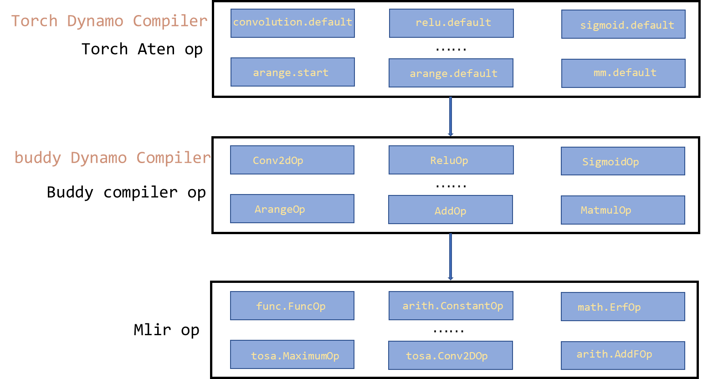

## 算子融合

**背景：**计算图在执行过程中存在两种问题：①内存墙。内存墙是部分访存密集型算子io操作过于密集，造成了频繁的内存交换，导致计算性能的的上限取决于内存带宽速率。②并行墙。并行墙是由于计算图中算子并行度不够高，无法充分利用GPU和NPU多核或众核的能力。

早期的手写算子融合，比如对生产者消费者算子进行loop fusion，可以提高中间张量的访存局部性，可以解决内存墙的问题。近年来的XLA、TVM等AI编译框架为了解决手工融合无法泛化的问题，提出自动loop fusion，即把相邻的存在数据依赖的算子自动进行Loop空间深度融合。但Loop Fusion相邻算子节点是否可融合受限于待融合算子的Loop循环是否可以进行有效的循环合并。而随着Rammer的发布，大家发现通过算子融合也可以解决并行墙的问题。Rammer提出一种将计算图中的算子节点进行并行编排，从而提升整体计算并行度。特别是对于网络中存在可并行的分支节点，这种方式可以获得较好的并行加速效果。所以算子融合其实有两种目的，为达成两种目的所采用的方法也不尽相同。

**思路：**内存墙问题：在buddy compiler front中由于lower的粒度太大，比如会直接lower到con2D上，会导致没办法做细粒度的loop fusion，只能通过小算子融合减少一些I/O操作，能否减少GPU kernel的开销要看后端具体实现。front前端能做的是识别出来哪些算子可以融合，分在一个组里面，将融合的算子输入输出直连，而lower操作是不会变的。循环层面的优化要到mlir里面做。

并行墙问题：可以借鉴Rammer算法，能够将buddy compiler op进行重新编排。

以下列出的方案是解决内存墙问题的方案。

方案①：使用TVM采取的支配树方案，基于规则实现算子融合。这种方案的好处是可以自动匹配可以融合的算子，在算子种类增多的时候无需手写融合后的算子。

方案②：遍历方案。需要对整个计算DAG图进行遍历，实现典型的计算密集型+访存密集型的融合算子。好处是实现较为简单，在遍历DAG图时只需要提供算子的名称即可完成匹配，融合算子的种类可以分为如下几类kernel 融合、纵向层融合和横向层融合。

比如上图中enlarge conv+fuse conv做了kernel间融合，conv2d 1\*1*256先填充0扩展至3\*3\*256的维度，然后将他们做fuse。这样虽然计算量增大，但可以将两次kernel的开销降为1次，访存也只需要一次。

fuse conv+add横向融合中将conv和add融合，横向的意思是add和conv都会使用到split后产生的数据，所以让他们融合成一个算子，使得本应访问两次内存降为了一次。

fuse conv+relu纵向融合中将conv和relu融合，纵向的意思是relu会使用到conv运算产生的结果，因此直接将两个算子融合为一个，减少中间结果的写回和访问操作。

各个深度学习框架或推理框架会有自己手工融合的种类，比torch中：

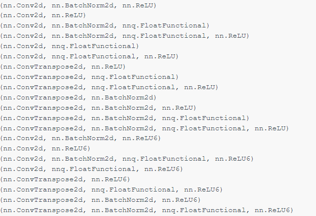

以上两种方案都是在python前端对不同的算子进行分组，不同的是遍历方案是模式匹配，模式需要手写。而基于规则的方案是自动生成组别。但两种方案都需要在后续lower到mlir后，在mlir op中对融合后的算子进行支持和加速。比如Conv+Relu的成为划归到一个group，conv会先lower到tosa.conv2d，relu会lower到tosa.constop和tosa.maximumop，将group num也lower到对应的milr op上(作为attr?)。在lower到loop层面之后，在对循环层面做优化。

## 布局转换

**背景：**在深度学习领域，多维数据通过多维数组存储，比如卷积神经网络的特征图（feature map）通常用四维数组保存。即NCHW或NHWC。其中N代表batch size的大小，C代表特征图chennel数量，H代表特征图高度，W代表特征图宽度。深度学习框架中，布局一般为NCHW或NHWC。

NCHW布局中，同一个通道的数据值连续排布，更适合需要对每个通道单独运算的操作，如 MaxPooling。NCHW 计算时需要的存储更多，适合GPU运算，利用 GPU 内存带宽较大并且并行性强的特点.

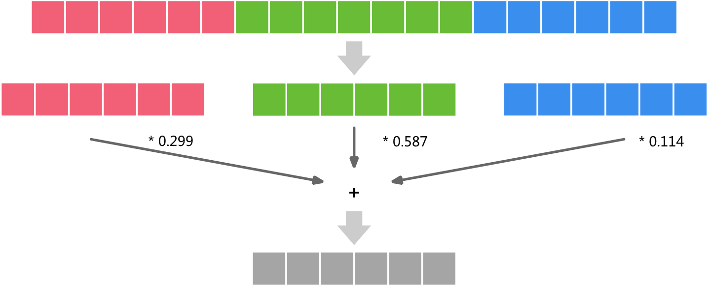

NHWC 布局中，其不同通道中的同一位置元素顺序存储，因此更适合那些需要对不同通道的同一数据做某种运算的操作，比如“Conv1x1”。NHWC 更适合多核CPU运算，CPU 内存带宽相对较小，每个数据计算的时延较低，临时空间也很小，有时计算机采取异步的方式边读边算来减小访存时间，因此计算控制灵活且复杂

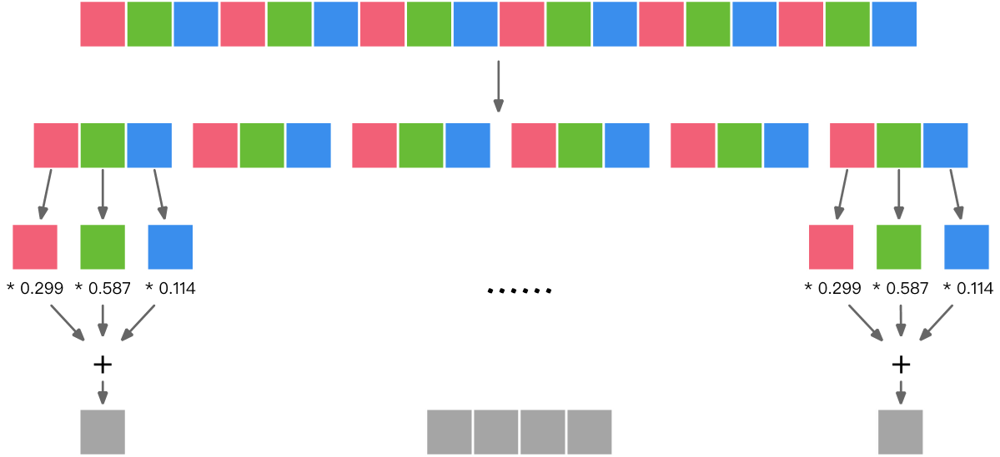

**思路：**在front前端，根据每个算子的device和运算类型，决定最友好的布局格式。测试算子添加layout transform pass后的运行时间。如果添加layout transform pass后，减少的计算时间大于做layout transform的时间，那么对这个算子采取layout transform pass，否则不做layout transform pass。

在计算完成后，如果结果的layout 符合消费者最友好的布局格式，则直接传递给消费者。否则转换回输入的layout。

同时，不仅feature map可以做layout transform，weight也可以做layout transform，通过对weight 做 layout transform将计算期间的列主序访问转换为行主序访问，不过这一般在算子层面做优化。

## 内存分配

**背景：**推理过程中的内存分配大概可以分为以下四类：输入input内存分配、算子输出tensor内存分配、算子attr如weight、bias内存分配和算子运行时一些额外运算buffer的申请。

**思路：**内存分配算法可以分成两个部分：张量生命期的分析和内存分配。首先，给定计算图之后，唯一决定张量生命期的就是节点（算子）的执行顺序。在推理时由于我们已经完全拿到了model的DAG图和确切的执行顺序，所以一般只要以某种拓扑序要遍历计算图就可以生成一个依赖正确的节点的执行顺序，进而决定出每个张量的生命期，即分配和释放的时间点。可以在每个node上添加时间点得到。

在推理阶段，整个计算图已经确定下来了，那么计算图所用到的所有内存已经确定。可以在导入计算图时对计算图所使用的内存进行虚拟分配，实际分配在mlir中分配。虚拟分配时，根据节点执行顺序，分析计算图每个node相关联张量的张量生命期，计算得到每个tensor所分配内存块的信息，比如内存块大小、内存块id，分配内存的顺序等。

**具体操作：**如果节省内存？

①原地更新、替换操作：

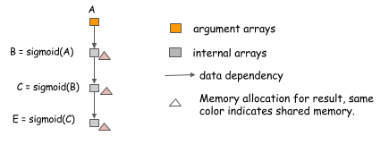

当某个算子的接下来的一个算子是element-wise函数，可以直接在上一个算子的内存空间上进行计算，无需额外申请空间。如图A到B到C到E算子，整个计算链没有申请额外空间。不过需要注意的是如下图所示吗，当B算子有一个额外consumer F做non-element-wise操作，不能再在A算子的内存上直接计算了，需要另外处理。

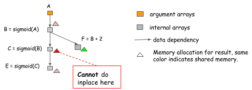

②内存共享基础——内存池算法

使用内存池算法，维护一个内存分配器。遍历一遍DAG图后提前算好各个算子的生命周期、孩子父母名称数量、需要的中间结果buffer和activation所占用的体积，按照每个张量的分配和释放顺序依次向内存池申请和释放对应大小的内存空间，并记录每个张量分配的地址偏移。当一个张量被释放回内存池时，后续的张量分配就可以自动复用前面的空间（具体请看后面的类寄存器分配算法）。当所有张量分配完时，内存池使用到的最大内存空间即为执行该计算图所需要的最小内存。在真实的运行时，我们只需要在内存中申请一块该大小的内存空间，并按照之前的记录的地址偏移为每个张量分配内存即可。这样即可以优化总内存的占用量，也可以避免运行时的内存分配维护开销。 

③内存共享算法——类寄存器分配算法

以每个变量作为节点，变量之间的重叠生命周期为边，构造冲突图，然后运行图着色算法。该算法如下图所示。按拓扑顺序遍历整个图，并使用计数器来记录还有多少个依赖于该节点并且还未进行计算的节点数目，即节点的生命周期。如果当前操作的输入变量没有被其他操作引用，即输入变量的计数器为1，那么当前操作的输出变量就可以使用置换操作。临时标签（图中的红、绿、蓝标签）用于指示内存共享。当节点计数器变为0时，可以回收节点的标签，右上角的矩形框里表示回收到的可以被重新利用的内存，当节点的生命周期没有重叠时，另一个节点使用回收标签就会发生内存共享。不过需要注意的是，图着色算法的复杂度为O(n^2^)，为np完全问题，计算图优化的时间可能会延长。

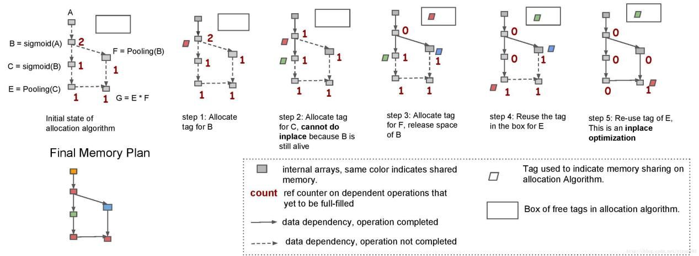

或者用一个更简单的启发式贪心算法：

当某个算子的子节点都已经计算完毕，可以认为其生命周期已经结束，weight所占用的空间和算子输出activation所使用的内存空间就可以被复用。如图所示，当B算子的子节点C计算完成后，存储B节点输出activation的内存置为空闲。当E节点开始时，遍历生命周期已经结束的算子，如果这之中的算子所申请的空间比E节点所需要的空间大，那么复用这个算子申请的空间。

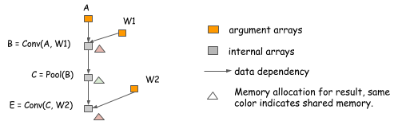

以上算法是在前端优化时做，相当于用动态内存分配模拟出了一份静态内存分配方案，在运行时可以直接根据分配到的内存id或地址偏移直接申请内存空间。

## 常量折叠

在front端做常量折叠或者传播，由于粒度很粗，只能做一些简单的op层面的常量折叠或传播。

**思路：**

①传统编译器理念上的常量折叠

比如一个算子没有变量输入，那么其可以直接作为常量输出给他的consumer。

②某些算子与数据形状shape有关系

比如tensorflow中的size，shape、rank算子，这些算子和输入的数据没有关系，只和输入的数据的形状有关系。在推理阶段，拿到的图都是静态图，shape已经确定，所以可以提前将这些值计算出来替换为const。（目前的front在写buddy compiler op时其实已经实现了这个功能）

③针对某些特殊规则算子的优化

最经典的例子BN折叠，由于在推理阶段，每个BN层的参数已经固定，BN就像是对上一层的结果进行简单的线性转换。由于卷积也是一个线性变换，所以两个操作可以合并成一个单一的线性变换，这会删除很多不必要的参数和操作数量。合并后的conv操作如图所示

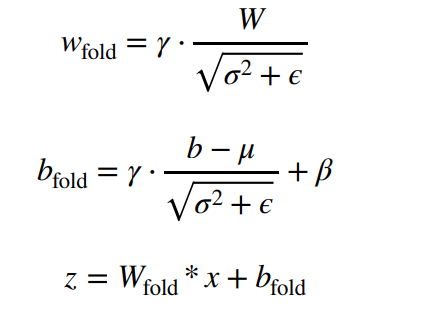

这和算子融合有些区别，这个可以直接在图优化过程中直接将conv操作和BN操作融合起来，删除BN操作，实际推理计算过程中就没有BN算子了。不过需要对各种类型的conv都要写一下，比如group conv、transpose conv。

## 死代码消除

在front端做死代码消除，由于粒度很粗，只能做一些简单的op层面的算子消除。

**思路：**①在前端，通过遍历DAG图，找出没有child的node，然后删除这个node。或者删除一些完全用不到的op比如printop，noop，dropoutop等。

②一些算子在设置了某些参数后变的没有意义。比如Add a 0、Mul a 1、Transpose、TensorConverter等这一类的算子，对这类算子遍历DAG图时检查其参数，确保其有意义。

③Op位置无意义。比如当Unsqueeze Op的输入是const Op时，可以将const Op进行Unsqueeze操作后直接删除Unsqueeze Op。模型的输出后接了一个内存排布，没有意义。

③类型重复算子。比如有两个来连续的reshape，可以直接合成一个去掉一个。

④Op前后反义。比如前一个时expand操作，后一个时squeeze操作，就可以删除。比如合并后又进行拆分，同样可以删除这两个op

## 代数化简

**背景：**利用交换律、结合律等规律调整途中算子的执行顺序，或者时删除不必要的算子。具体可以分为以下几个部分①算数化简:通过利用代数之间算术运算法则，在计算图中可以确定优化的运算符执行顺序，从而用新的运算符替换原有复杂的运算符组合。②运行化简：减少运算或者执行时候，冗余的算子或者算子对③广播化简：多个张量形状 Shape 不同，需要进行广播将张量的形状拓展为相同 shape 再进行运算，化简为最小计算所需的广播运算数量。

**思路：**代数化简其实就是子图替换的一套规则，我们需要将这些规则写到pass里面做替换。

比如以下几个例子：

①算数化简

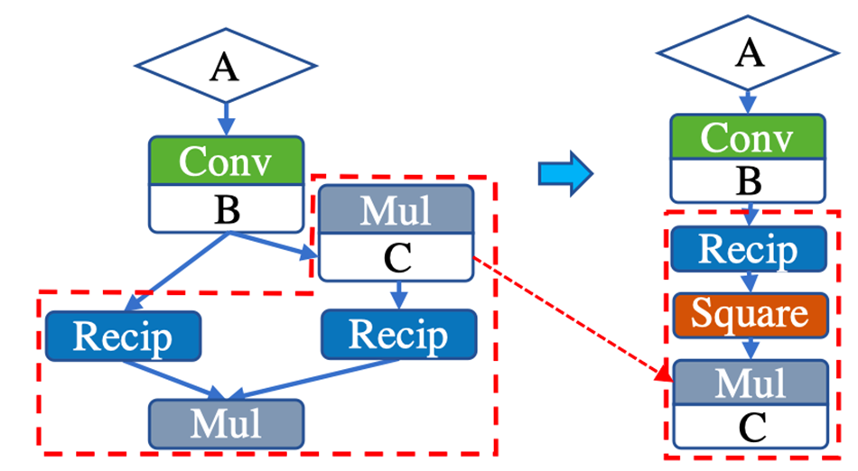

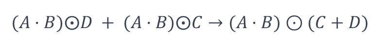

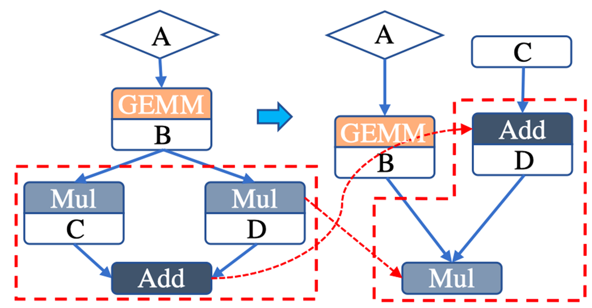

②运行化简

•对合算子化简：

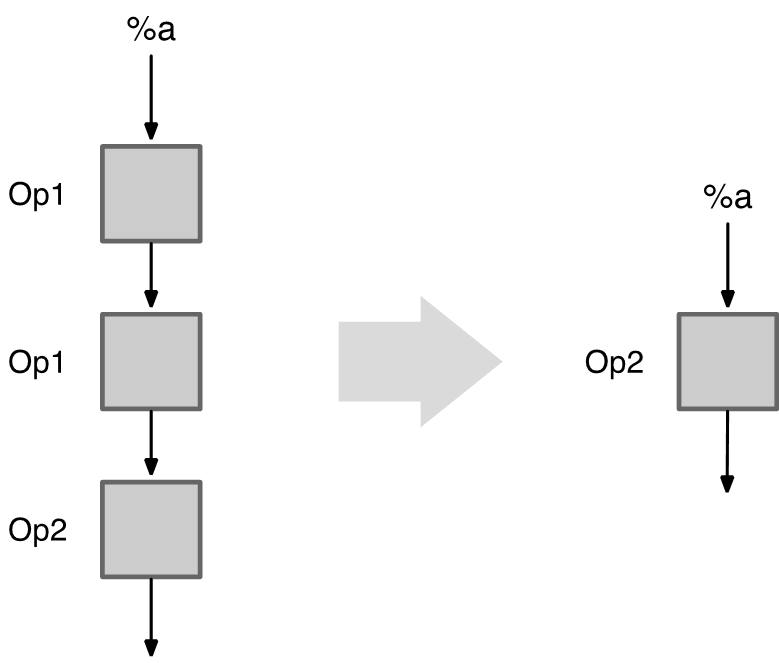

•幂等算子化简：

③广播化简

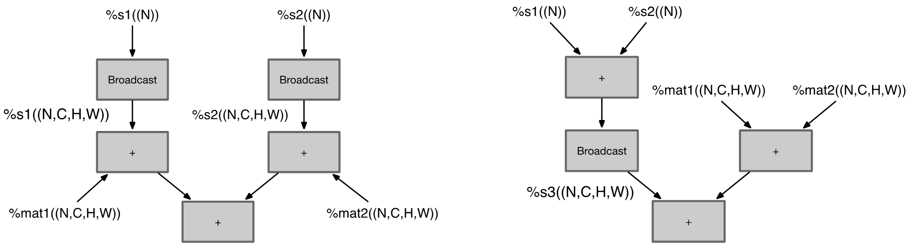