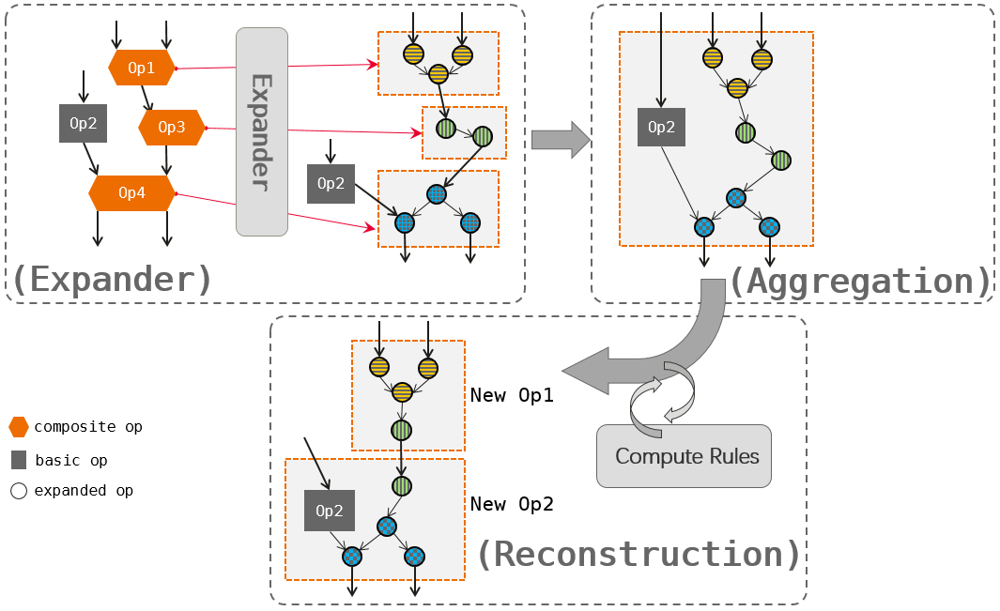

# Generic Graph-Level Compilation Optimization Deep Learning Models

Graph optimization in computation primarily targets hardware optimization. Based on whether the optimization applies to all hardware or specific hardware, it can be categorized into generic hardware optimization and specific hardware optimization. For example, subgraph transformations made to adapt to hardware instruction limitations are specific hardware optimizations, whereas operator memory I/O optimizations independent of specific hardware are generic hardware optimizations. Generic hardware optimization mainly refers to computation graph optimizations that are independent of specific hardware types. The core of this optimization is subgraph equivalence transformation: attempting to match specific subgraph structures within the computation graph, and once the target subgraph structure is found, replacing it with a hardware-friendly subgraph structure through equivalent substitution.

## Generic Hardware Optimization Strategies

### Fixed Operation Fusion

Deep learning operators can be divided into two categories based on their resource requirements: compute-intensive operators, which spend most of their time on computations, such as convolution and fully connected layers; and memory-intensive operators, which spend most of their time on memory access, such as element-wise operators like ReLU and element-wise sum.

In typical deep learning models, compute-intensive and memory-intensive operators often appear together. The simplest example is "Conv + ReLU." The convolution operator (Conv) is compute-intensive, while the ReLU operator is memory-intensive. The ReLU operator can directly compute the result of the convolution operator. Therefore, they can be fused into a single operator to reduce memory access latency and bandwidth pressure, thus improving execution efficiency.

Based on existing research, we can list fixed operator fusion strategies and implement them in the Buddy Compiler.

### Data Layout Transformation

Data layout optimization transforms the computation graph to execute on target hardware with better internal data layouts. First, given the constraints specified by the memory hierarchy, we designate preferred data layouts for each operator. Then, if the producer and consumer have mismatched preferred data layouts, we perform appropriate layout transformations between the producer and consumer.

### Dead Code Elimination

Dead code elimination removes redundant calculations that do not impact the final output, reducing computational load and memory usage.

### Common Subexpression Elimination (CSE)

Common subexpression elimination identifies and removes duplicate subexpressions within the computation graph, reducing redundant computations.

### Arithmetic Expression Simplification

Arithmetic expression simplification reduces the complexity of calculations by merging or eliminating redundant operations.

### Graph Computation Fusion

1. Subgraph Division: Extract all suitable operators for fusion (excluding custom operators, highly complex operators, and control flow operators), decompose compound operators, and aggregate basic operators.
2. Graph Fusion: Perform fusion based on the graph obtained from the division stage.

## Integration with Buddy Compiler

#### Description

The proposed optimizations will be integrated into the Buddy Compiler's existing framework, leveraging its MLIR-based representation and compilation pipeline.

#### Implementation Plan

1. **Extend Graph Class:** Modify the `Graph` class to include methods for each optimization technique.
2. **Implement Fusion Patterns:** Develop functions for identifying and applying fusion patterns within the graph.
3. **Transform Data Layouts:** Add methods for layout transformation based on hardware-specific requirements.
4. **Eliminate Dead Code:** Integrate dead code elimination passes into the graph processing pipeline.
5. **Apply Subexpression Elimination:** Develop techniques for detecting and eliminating common subexpressions.
6. **Simplify Arithmetic Expressions:** Implement methods for arithmetic expression simplification.

### Expected Outcomes

1. **Improved Model Performance:** Enhanced runtime performance and efficiency of deep learning models.
2. **Reduced Memory Footprint:** Optimized memory usage through allocation strategies and layout transformations.
3. **Streamlined Computational Graph:** Simplified and optimized computational graph for faster execution.