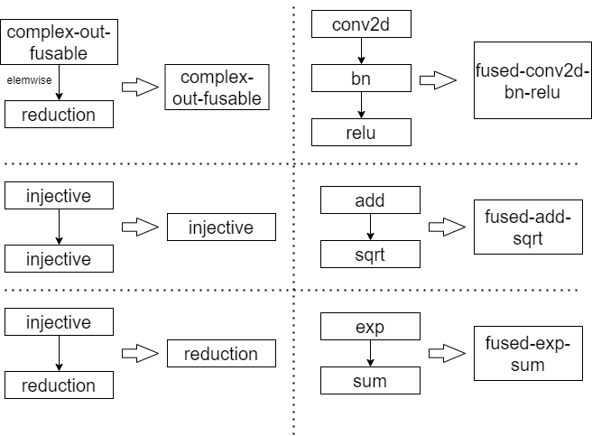

# Graph Optimization methods
In deep learning compilation, optimizing the performance and efficiency of the model is crucial. Using various layer optimization technologies, such as Fusion, Memory Allocation, Layout Transformation, Dead Code Elimination, and Arithmetic Expression Simplification, the execution efficiency of the model can be significantly improved. The following is an optimization technical solution that combines graphics and text.
### 1. Operation Fusion
In TVM, graph operators are divided into four types: (1) injective (one-to-one map, e.g., add), (2) reduction (e.g., sum), (3) complexout-fusable (can fuse element-wise map to output, e.g., conv2d), and (4) opaque (cannot be fused, e.g., sort).

Multiple injective operators can be fused into another injective operator. A reduction operator can be fused with input injective operators (e.g., fuse scale and sum). Operators such as conv2d are complex-out-fusable, and we can fuse element-wise operators to its output. We can apply these rules to transform the computational graph into a fused version.

In Buddy-mlir, operators are divided into nine types: 
```python
- BroadcastType: int
	Represents a broadcast operation.
- ElementwiseType: int
	Represents an elementwise operation.
- ReshapeType: int
	Represents a reshape operation.
- ReduceType: int
	Represents a reduction operation.
- ConcatType: int
	Represents a concatenation operation.
- PlaceholderType: int
	Represents a placeholder operation.
- GetItemType: int
	Represents an operation to retrieve an item.
```
We can regard as having the following relationship: ReduceType = reduction + Complexout-fusable; ElementwiseType = injective.
We can apply Operation fusion on ElementwiseType operations. If consecutive elementwise operations can be represented as a more complex single elementwise operation, they can be fused. For example, fusing x + y and z * w into a single operation (x + y) * (z * w). 
Besides, we can also apply Operation fusion on BroadcastType and ElementwiseType. When a broadcast operation is followed by an elementwise operation, they can be fused. For instance, fusing broadcast(x) and x + y into a broadcast addition operation.

**schematic diagram：**
<center>
	
</center>

**example：**
```
original code：
  A = Conv2D(X, W1)
  B = BatchNorm(A)
  C = Relu(B, W2)

after fusion：
  C = conv2d-bn-relu(X, W1)
```


### 2. Memory Allocation Optimization
Memory allocation optimization involves reducing the overhead of memory allocation, reducing memory footprint by reusing intermediate variables and optimizing memory layout.

**example：**
```
original：
  Allocate memory for A
  Allocate memory for B
  Allocate memory for C

after optimization：
  Allocate memory for A/B/C (reuse same memory space if possible)
```

### 3. Data Layout Transformation
Layout Transformation optimization improves memory access efficiency and computational parallelism by changing the storage format of tensors.

In TVM, Data layout Transformation executes as below:
> Data layout optimization converts a computational graph into one that can use better internal data layouts for execution on the target hardware. It starts by specifying the preferred data layout for each operator given the constraints dictated by memory hierarchies. We then perform the proper layout transformation between a producer and a consumer if their preferred data layouts do not match.
> 
such as from NCHW to NHWC: 
From a content access perspective, NHWC reduces the memory access bottleneck of the GPU, thereby optimizing performance, and seems to be a better choice compared to NCHW.
according to [How much faster is NCHW compared to NHWC in TensorFlow/cuDNN?](https://stackoverflow.com/questions/44280335/how-much-faster-is-nchw-compared-to-nhwc-in-tensorflow-cudnn)：
> Most TensorFlow operations used by a CNN support both NHWC and NCHW data format. On GPU, NCHW is faster. But on CPU, NHWC is sometimes faster.
> 

- ReshapeType Optimization:

  Choose the optimal data layout based on subsequent operations' needs. For instance, converting data from NHWC to NCHW format for convolution operations.

**example：**

```
original layout：
  Tensor X with NHWC format

After transforms：
  Tensor X transformed to NCHW format
```

### 4. Dead Code Elimination
Dead code elimination refers to removing redundant calculations that do not affect the final output, thereby reducing the amount of calculation and memory consumption.

**example：**

```
original code：
  A = Conv2D(X, W1)
  B = UnusedOperation(A)
  C = Conv2D(A, W2)

after dce：
  A = Conv2D(X, W1)
  C = Conv2D(A, W2)
```

### 5. Common Subexpression Elimination (CSE)
Identifying and eliminating duplicate subexpressions within the computation graph.

- Identifying Repeated Calculations:

  If the same expression appears multiple times in the computation graph, it can be computed once and reused. For example, computing x * y once and reusing the result in different parts of the graph.

**example：**

```
original code：
  A = X * Y
  B = X * Y
  C = X * Y

  K = A + B * C

after simplification：
  A = X * Y
  K = A + A * A
```

### 6. Arithmetic Expression Simplification
Arithmetic expression simplification reduces the amount of calculations by simplifying calculation expressions. For example, merge or eliminate redundant operations such as multiplication and addition.

**example：**

```
original code：
  Y = X * 1 + 0

after simplification：
  Y = X
```

### 7. Algebraic optimization
Algebraic optimization is the equivalent exchange of queries to reduce execution overhead. The so-called equivalence means that the result obtained by the relational algebra expression after transformation is the same as the relational algebra expression before transformation.

**example:**
```
original code
  A = transpose(X)
  B = transpose(A)

after optimization
  B = X
```

In Algebraic optimization, we can also do Constant Folding on ElementwiseType and Constants.
Constant folding computes constant expressions at compile time, reducing the runtime computational load. If an elementwise operation involves constants, it can be computed at compile time. For example, replacing x + 2 with the constant result directly.

