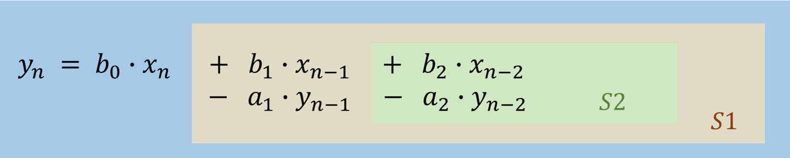
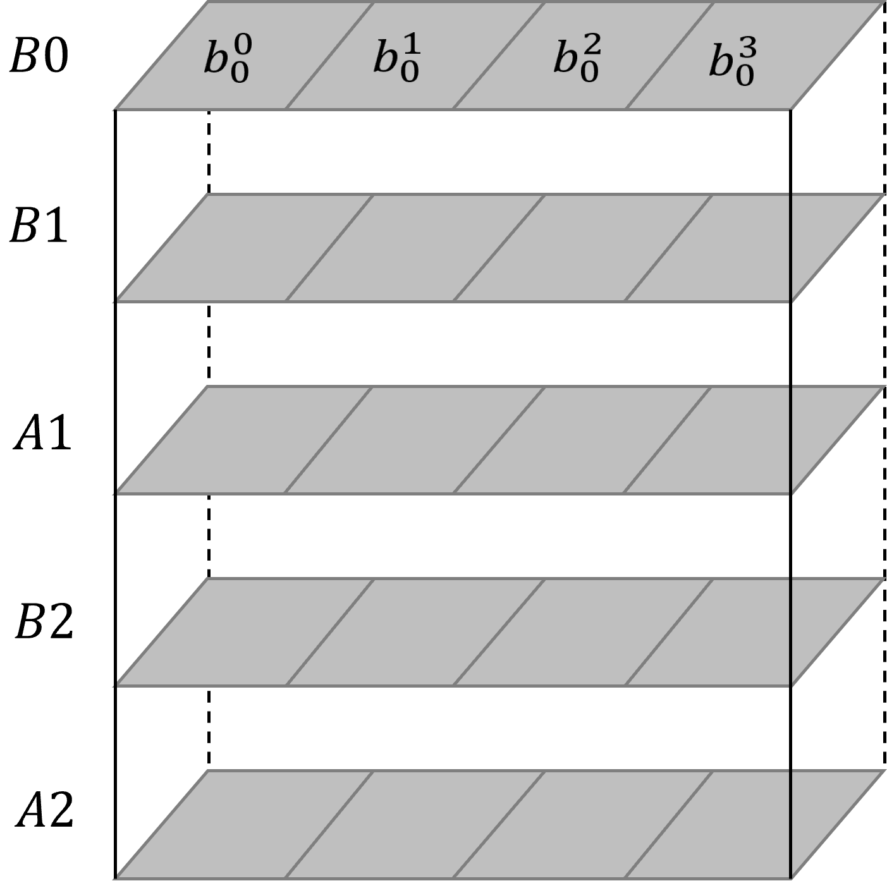
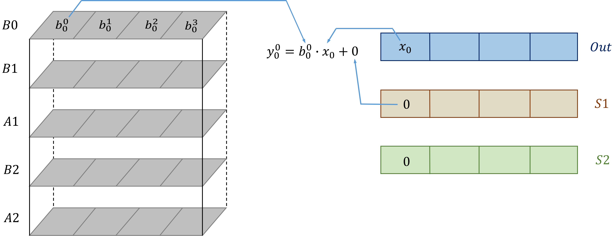
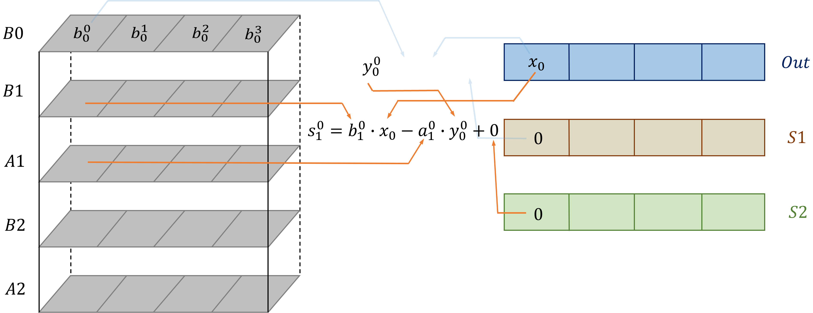
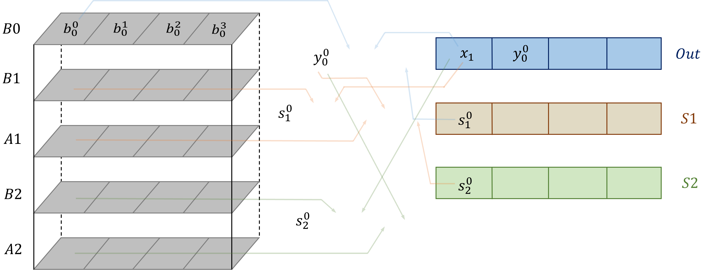

# Algorithm Explanation

This document shows the details of the algorithms used in DAPVectorization pass. 

## IIR Vectorization Implementation

IIR filter can represent in different forms, typically ZPK(Zero-Pole-Gain) form or SOS(Second-Order Sections) form. Filter can be defined in ZPK form and then transformed to SOS form.

### Scalar Computation for IIR Operation

Currently, our IIR operation supports filter with SOS form. When the filter has only one set of parameters, denoted as {$𝑏_0, 𝑏_1, b_2, a_1, a_2$}, distinguishing parameters by subscripts. The equation is shown in the following form:

**IIR with one set of params:**
$$ y_n = 𝑏_0 𝑥_𝑛 + 𝑏_1 𝑥_{𝑛−1} − 𝑎_1 𝑦_{𝑛−1} + 𝑏_2 𝑥_{𝑛−2} − 𝑎_2 𝑦_{𝑛−2} $$

When the filter have multiple sets of filters, the operation use a cascade method for calculation. Take two sets of params as an example, filter parameters denoted as {$𝑏_0^0, 𝑏_1^0, b_2^0, a_1^0, a_2^0$} and {$𝑏_0^1, 𝑏_1^1, b_2^1, a_1^1, a_2^1$}, superscript indicates parameters from different sets. The process is listed below:

**IIR with two sets of params:**
$$y_n^0 = 𝑏_0^0 𝑥_𝑛^0 + 𝑏_1^0 𝑥_{𝑛−1}^0 − 𝑎_1^0 𝑦_{𝑛−1}^0 + 𝑏_2^0 𝑥_{𝑛−2}^0 − 𝑎_2^0 𝑦_{𝑛−2}^0 $$
$$x_n^1 = y_n^0$$
$$y_n^1 = 𝑏_0^1 𝑥_𝑛^1 + 𝑏_1^1 𝑥_{𝑛−1}^1 − 𝑎_1^1 𝑦_{𝑛−1}^1 + 𝑏_2^1 𝑥_{𝑛−2}^1 − 𝑎_2^0 𝑦_{𝑛−2}^1$$

### Vectorization for IIR Operation

This section shows the implementation of IIR Vectorization algorithm. The example shown below contains 4 sets of parameters, with superscript {$0, 1, 2, 3$} representing each set of parameters.

1. **Segment IIR Equation & Generate Vector Params**
   
    IIR equation were segmented into 3 parts, each part were calculated in different time moment. When $S2$ was calculated at time $t_i$, it will be used to calculate $S1$ at time $t_{i+1}$, then produce the final result at time $t_{i+2}$.

   
    In the above image, vector $B0$ were the collection of all $b_0$ params, other vectors $B1, B2, A1, A2$ each collect there corresponding params. 
    
2. **Computing One Set of Params**
   
    The first step in computation, calculate $y_0^0$ with the following equation:
    $$𝑦_0^0=𝑏_0^0𝑥_0+s_1^0$$
    At time moment $0$, the initial values of $S1, S2$ were set to $0$.
   
    The second step in computation, calculate $s_1^0$ with the following equation:
    $$𝑠_1^0=𝑏_1^0𝑥_0−𝑎_1^0𝑦_0^0+s_2^0 $$
   
    The third step in computation, calculate $s_2^0$ with the following equation:
    $$𝑠_2^0=𝑏_2^0𝑥_0−𝑎_2^0𝑦_0^0$$

    The above three steps happen in the same time moment $t$, which is the same loop iteration in program. The order of these three steps cannot change, because the value from vector $S1, S2$ were actually produced before time moment $t$.
3. **Cascade Method**
   
    Now the values $y_0^0$, $s_1^0$ and $s_2^0$ were produced, here the whole system will get a new input $x1$ and move on the computation.
   
    The $y_0^0$ were moved right and the new input $x1$ were pushed in. The value in vector $S1$ and $S2$ are not changed and will jump back to the second step. The difference in the next iteration is that two sets of parameters are used and this is where the performance improves.

    When the example above came to the fourth iteration, the computation will be using all the parameters. This situation occurs for the vast majority of the time during the computation. Also, considering a longer vector length(currently support 4, 8, 16, 32, 64), it can achieve a 10x performance improvement.
