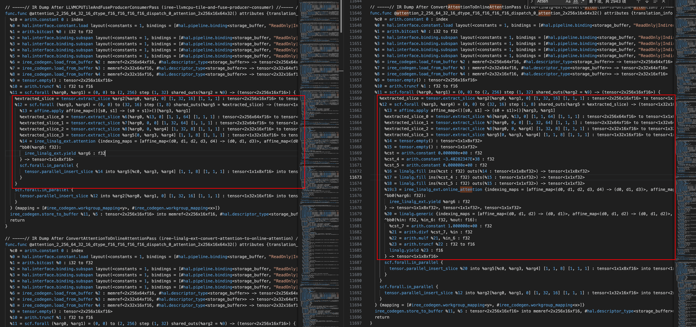

# IREE Learning Notes: Exploring Memory Optimization and Incremental Computation of Attention Operator Through IREE Source Code (0)

File path: `iree/compiler/src/iree/compiler/Dialect/LinalgExt/Transforms/TileAttention.cpp`.

## Preparation
### Test File Generation
File path: `iree/tests/e2e/attention`
```
python generate_e2e_attention_tests.py \
    --output_attention_mlir attention.mlir \
    --output_calls_mlir calls.mlir \
    --query_type f16 \
    --key_type f16 \
    --value_type f16 \
    --shapes_scale small
```
Generated test script:
```
func.func @attention_2_256_64_32_16_dtype_f16_f16_f16_f16(%query: tensor<2x256x64xf16>, %key: tensor<2x32x64xf16>, %value: tensor<2x32x16xf16>, %scale: f32) -> tensor<2x256x16xf16> {
  %result0 = tensor.empty(): tensor<2x256x16xf16>
  %scale_f16 = arith.truncf %scale : f32 to f16
  %result1 = iree_linalg_ext.attention {
      indexing_maps = [affine_map<(batch, m, n, k1, k2) -> (batch, m, k1)>,
                       affine_map<(batch, m, n, k1, k2) -> (batch, k2, k1)>,
                       affine_map<(batch, m, n, k1, k2) -> (batch, k2, n)>,
                       affine_map<(batch, m, n, k1, k2) -> ()>,
                       affine_map<(batch, m, n, k1, k2) -> (batch, m, n)>]
}      ins(%query, %key, %value, %scale_f16: tensor<2x256x64xf16>, tensor<2x32x64xf16>, tensor<2x32x16xf16>, f16)
      outs(%result0: tensor<2x256x16xf16>) {
   ^bb0(%score: f32):
   iree_linalg_ext.yield %score : f32
 } -> tensor<2x256x16xf16>
 return %result1: tensor<2x256x16xf16>
}
```

Run with the following command, the generated log will be saved in compile_debug.log:

```Bash
iree-compile attention.mlir \
    --iree-hal-target-backends=llvm-cpu \
    --mlir-print-ir-after-all \
    2>&1 | tee compile_debug.log
```

## Change Analysis
Here is the IR before `ConvertAttentionToOnlineAttentionPass`:
```MLIR
// -----// IR Dump After LLVMCPUTileAndFuseProducerConsumerPass (iree-llvmcpu-tile-and-fuse-producer-consumer) //----- //
func.func @attention_2_256_64_32_16_dtype_f16_f16_f16_f16_dispatch_0_attention_2x256x16x64x32() attributes {translation_info = #iree_codegen.translation_info<pipeline = CPULinalgExtTileAndVectorize>} {
  %c0 = arith.constant 0 : index
  %0 = hal.interface.constant.load layout(<constants = 1, bindings = [#hal.pipeline.binding<storage_buffer, "ReadOnly|Indirect">, #hal.pipeline.binding<storage_buffer, "ReadOnly|Indirect">, #hal.pipeline.binding<storage_buffer, "ReadOnly|Indirect">, #hal.pipeline.binding<storage_buffer, Indirect>], flags = Indirect>) ordinal(0) : i32
  %1 = arith.bitcast %0 : i32 to f32
  %2 = hal.interface.binding.subspan layout(<constants = 1, bindings = [#hal.pipeline.binding<storage_buffer, "ReadOnly|Indirect">, #hal.pipeline.binding<storage_buffer, "ReadOnly|Indirect">, #hal.pipeline.binding<storage_buffer, "ReadOnly|Indirect">, #hal.pipeline.binding<storage_buffer, Indirect>], flags = Indirect>) binding(0) alignment(64) offset(%c0) flags("ReadOnly|Indirect") : memref<2x256x64xf16, #hal.descriptor_type<storage_buffer>>
  %3 = hal.interface.binding.subspan layout(<constants = 1, bindings = [#hal.pipeline.binding<storage_buffer, "ReadOnly|Indirect">, #hal.pipeline.binding<storage_buffer, "ReadOnly|Indirect">, #hal.pipeline.binding<storage_buffer, "ReadOnly|Indirect">, #hal.pipeline.binding<storage_buffer, Indirect>], flags = Indirect>) binding(1) alignment(64) offset(%c0) flags("ReadOnly|Indirect") : memref<2x32x64xf16, #hal.descriptor_type<storage_buffer>>
  %4 = hal.interface.binding.subspan layout(<constants = 1, bindings = [#hal.pipeline.binding<storage_buffer, "ReadOnly|Indirect">, #hal.pipeline.binding<storage_buffer, "ReadOnly|Indirect">, #hal.pipeline.binding<storage_buffer, "ReadOnly|Indirect">, #hal.pipeline.binding<storage_buffer, Indirect>], flags = Indirect>) binding(2) alignment(64) offset(%c0) flags("ReadOnly|Indirect") : memref<2x32x16xf16, #hal.descriptor_type<storage_buffer>>
  %5 = hal.interface.binding.subspan layout(<constants = 1, bindings = [#hal.pipeline.binding<storage_buffer, "ReadOnly|Indirect">, #hal.pipeline.binding<storage_buffer, "ReadOnly|Indirect">, #hal.pipeline.binding<storage_buffer, "ReadOnly|Indirect">, #hal.pipeline.binding<storage_buffer, Indirect>], flags = Indirect>) binding(3) alignment(64) offset(%c0) flags(Indirect) : memref<2x256x16xf16, #hal.descriptor_type<storage_buffer>>
  %6 = iree_codegen.load_from_buffer %2 : memref<2x256x64xf16, #hal.descriptor_type<storage_buffer>> -> tensor<2x256x64xf16>
  %7 = iree_codegen.load_from_buffer %3 : memref<2x32x64xf16, #hal.descriptor_type<storage_buffer>> -> tensor<2x32x64xf16>
  %8 = iree_codegen.load_from_buffer %4 : memref<2x32x16xf16, #hal.descriptor_type<storage_buffer>> -> tensor<2x32x16xf16>
  %9 = tensor.empty() : tensor<2x256x16xf16>
  %10 = arith.truncf %1 : f32 to f16
  %11 = scf.forall (%arg0, %arg1) = (0, 0) to (2, 256) step (1, 32) shared_outs(%arg2 = %9) -> (tensor<2x256x16xf16>) {
    %extracted_slice = tensor.extract_slice %arg2[%arg0, %arg1, 0] [1, 32, 16] [1, 1, 1] : tensor<2x256x16xf16> to tensor<1x32x16xf16>
    %12 = scf.forall (%arg3, %arg4) = (0, 0) to (32, 16) step (1, 8) shared_outs(%arg5 = %extracted_slice) -> (tensor<1x32x16xf16>) {
      %13 = affine.apply affine_map<()[s0, s1] -> (s0 + s1)>()[%arg3, %arg1]
      %extracted_slice_0 = tensor.extract_slice %6[%arg0, %13, 0] [1, 1, 64] [1, 1, 1] : tensor<2x256x64xf16> to tensor<1x1x64xf16>
      %extracted_slice_1 = tensor.extract_slice %7[%arg0, 0, 0] [1, 32, 64] [1, 1, 1] : tensor<2x32x64xf16> to tensor<1x32x64xf16>
      %extracted_slice_2 = tensor.extract_slice %8[%arg0, 0, %arg4] [1, 32, 8] [1, 1, 1] : tensor<2x32x16xf16> to tensor<1x32x8xf16>
      %extracted_slice_3 = tensor.extract_slice %arg5[0, %arg3, %arg4] [1, 1, 8] [1, 1, 1] : tensor<1x32x16xf16> to tensor<1x1x8xf16>
      %14 = iree_linalg_ext.attention {indexing_maps = [affine_map<(d0, d1, d2, d3, d4) -> (d0, d1, d3)>, affine_map<(d0, d1, d2, d3, d4) -> (d0, d4, d3)>, affine_map<(d0, d1, d2, d3, d4) -> (d0, d4, d2)>, affine_map<(d0, d1, d2, d3, d4) -> ()>, affine_map<(d0, d1, d2, d3, d4) -> (d0, d1, d2)>], lowering_config = #iree_cpu.lowering_config<distribution = [1, 32, 16, 0, 0], vector_common_parallel = [1, 1, 8, 0, 0], vector_reduction = [0, 0, 0, 0, 2]>} ins(%extracted_slice_0, %extracted_slice_1, %extracted_slice_2, %10 : tensor<1x1x64xf16>, tensor<1x32x64xf16>, tensor<1x32x8xf16>, f16) outs(%extracted_slice_3 : tensor<1x1x8xf16>) {
      ^bb0(%arg6: f32):
        iree_linalg_ext.yield %arg6 : f32
      } -> tensor<1x1x8xf16>
      scf.forall.in_parallel {
        tensor.parallel_insert_slice %14 into %arg5[%c0, %arg3, %arg4] [1, 1, 8] [1, 1, 1] : tensor<1x1x8xf16> into tensor<1x32x16xf16>
      }
    }
    scf.forall.in_parallel {
      tensor.parallel_insert_slice %12 into %arg2[%arg0, %arg1, 0] [1, 32, 16] [1, 1, 1] : tensor<1x32x16xf16> into tensor<2x256x16xf16>
    }
  } {mapping = [#iree_codegen.workgroup_mapping<y>, #iree_codegen.workgroup_mapping<x>]}
  iree_codegen.store_to_buffer %11, %5 : tensor<2x256x16xf16> into memref<2x256x16xf16, #hal.descriptor_type<storage_buffer>>
  return
}
```

Here is the IR after `ConvertAttentionToOnlineAttentionPass`:
```MLIR
// -----// IR Dump After ConvertAttentionToOnlineAttentionPass (iree-linalg-ext-convert-attention-to-online-attention) //----- //
func.func @attention_2_256_64_32_16_dtype_f16_f16_f16_f16_dispatch_0_attention_2x256x16x64x32() attributes {translation_info = #iree_codegen.translation_info<pipeline = CPULinalgExtTileAndVectorize>} {
  %c0 = arith.constant 0 : index
  %0 = hal.interface.constant.load layout(<constants = 1, bindings = [#hal.pipeline.binding<storage_buffer, "ReadOnly|Indirect">, #hal.pipeline.binding<storage_buffer, "ReadOnly|Indirect">, #hal.pipeline.binding<storage_buffer, "ReadOnly|Indirect">, #hal.pipeline.binding<storage_buffer, Indirect>], flags = Indirect>) ordinal(0) : i32
  %1 = arith.bitcast %0 : i32 to f32
  %2 = hal.interface.binding.subspan layout(<constants = 1, bindings = [#hal.pipeline.binding<storage_buffer, "ReadOnly|Indirect">, #hal.pipeline.binding<storage_buffer, "ReadOnly|Indirect">, #hal.pipeline.binding<storage_buffer, "ReadOnly|Indirect">, #hal.pipeline.binding<storage_buffer, Indirect>], flags = Indirect>) binding(0) alignment(64) offset(%c0) flags("ReadOnly|Indirect") : memref<2x256x64xf16, #hal.descriptor_type<storage_buffer>>
  %3 = hal.interface.binding.subspan layout(<constants = 1, bindings = [#hal.pipeline.binding<storage_buffer, "ReadOnly|Indirect">, #hal.pipeline.binding<storage_buffer, "ReadOnly|Indirect">, #hal.pipeline.binding<storage_buffer, "ReadOnly|Indirect">, #hal.pipeline.binding<storage_buffer, Indirect>], flags = Indirect>) binding(1) alignment(64) offset(%c0) flags("ReadOnly|Indirect") : memref<2x32x64xf16, #hal.descriptor_type<storage_buffer>>
  %4 = hal.interface.binding.subspan layout(<constants = 1, bindings = [#hal.pipeline.binding<storage_buffer, "ReadOnly|Indirect">, #hal.pipeline.binding<storage_buffer, "ReadOnly|Indirect">, #hal.pipeline.binding<storage_buffer, "ReadOnly|Indirect">, #hal.pipeline.binding<storage_buffer, Indirect>], flags = Indirect>) binding(2) alignment(64) offset(%c0) flags("ReadOnly|Indirect") : memref<2x32x16xf16, #hal.descriptor_type<storage_buffer>>
  %5 = hal.interface.binding.subspan layout(<constants = 1, bindings = [#hal.pipeline.binding<storage_buffer, "ReadOnly|Indirect">, #hal.pipeline.binding<storage_buffer, "ReadOnly|Indirect">, #hal.pipeline.binding<storage_buffer, "ReadOnly|Indirect">, #hal.pipeline.binding<storage_buffer, Indirect>], flags = Indirect>) binding(3) alignment(64) offset(%c0) flags(Indirect) : memref<2x256x16xf16, #hal.descriptor_type<storage_buffer>>
  %6 = iree_codegen.load_from_buffer %2 : memref<2x256x64xf16, #hal.descriptor_type<storage_buffer>> -> tensor<2x256x64xf16>
  %7 = iree_codegen.load_from_buffer %3 : memref<2x32x64xf16, #hal.descriptor_type<storage_buffer>> -> tensor<2x32x64xf16>
  %8 = iree_codegen.load_from_buffer %4 : memref<2x32x16xf16, #hal.descriptor_type<storage_buffer>> -> tensor<2x32x16xf16>
  %9 = tensor.empty() : tensor<2x256x16xf16>
  %10 = arith.truncf %1 : f32 to f16
  %11 = scf.forall (%arg0, %arg1) = (0, 0) to (2, 256) step (1, 32) shared_outs(%arg2 = %9) -> (tensor<2x256x16xf16>) {
    %extracted_slice = tensor.extract_slice %arg2[%arg0, %arg1, 0] [1, 32, 16] [1, 1, 1] : tensor<2x256x16xf16> to tensor<1x32x16xf16>
    %12 = scf.forall (%arg3, %arg4) = (0, 0) to (32, 16) step (1, 8) shared_outs(%arg5 = %extracted_slice) -> (tensor<1x32x16xf16>) {
      %13 = affine.apply affine_map<()[s0, s1] -> (s0 + s1)>()[%arg3, %arg1]
      %extracted_slice_0 = tensor.extract_slice %6[%arg0, %13, 0] [1, 1, 64] [1, 1, 1] : tensor<2x256x64xf16> to tensor<1x1x64xf16>
      %extracted_slice_1 = tensor.extract_slice %7[%arg0, 0, 0] [1, 32, 64] [1, 1, 1] : tensor<2x32x64xf16> to tensor<1x32x64xf16>
      %extracted_slice_2 = tensor.extract_slice %8[%arg0, 0, %arg4] [1, 32, 8] [1, 1, 1] : tensor<2x32x16xf16> to tensor<1x32x8xf16>
      %extracted_slice_3 = tensor.extract_slice %arg5[0, %arg3, %arg4] [1, 1, 8] [1, 1, 1] : tensor<1x32x16xf16> to tensor<1x1x8xf16>
      %14 = tensor.empty() : tensor<1x1x8xf32>
      %15 = tensor.empty() : tensor<1x1xf32>
      %cst = arith.constant 0.000000e+00 : f32
      %cst_4 = arith.constant -3.40282347E+38 : f32
      %cst_5 = arith.constant 0.000000e+00 : f32
      %16 = linalg.fill ins(%cst : f32) outs(%14 : tensor<1x1x8xf32>) -> tensor<1x1x8xf32>
      %17 = linalg.fill ins(%cst_4 : f32) outs(%15 : tensor<1x1xf32>) -> tensor<1x1xf32>
      %18 = linalg.fill ins(%cst_5 : f32) outs(%15 : tensor<1x1xf32>) -> tensor<1x1xf32>
      %19:3 = iree_linalg_ext.online_attention {indexing_maps = [affine_map<(d0, d1, d2, d3, d4) -> (d0, d1, d3)>, affine_map<(d0, d1, d2, d3, d4) -> (d0, d4, d3)>, affine_map<(d0, d1, d2, d3, d4) -> (d0, d4, d2)>, affine_map<(d0, d1, d2, d3, d4) -> ()>, affine_map<(d0, d1, d2, d3, d4) -> (d0, d1, d2)>, affine_map<(d0, d1, d2, d3, d4) -> (d0, d1)>, affine_map<(d0, d1, d2, d3, d4) -> (d0, d1)>], lowering_config = #iree_cpu.lowering_config<distribution = [1, 32, 16, 0, 0], vector_common_parallel = [1, 1, 8, 0, 0], vector_reduction = [0, 0, 0, 0, 2]>} ins(%extracted_slice_0, %extracted_slice_1, %extracted_slice_2, %10 : tensor<1x1x64xf16>, tensor<1x32x64xf16>, tensor<1x32x8xf16>, f16) outs(%16, %17, %18 : tensor<1x1x8xf32>, tensor<1x1xf32>, tensor<1x1xf32>) {
      ^bb0(%arg6: f32):
        iree_linalg_ext.yield %arg6 : f32
      } -> tensor<1x1x8xf32>, tensor<1x1xf32>, tensor<1x1xf32>
      %20 = linalg.generic {indexing_maps = [affine_map<(d0, d1, d2) -> (d0, d1)>, affine_map<(d0, d1, d2) -> (d0, d1, d2)>, affine_map<(d0, d1, d2) -> (d0, d1, d2)>], iterator_types = ["parallel", "parallel", "parallel"]} ins(%19#2, %19#0 : tensor<1x1xf32>, tensor<1x1x8xf32>) outs(%extracted_slice_3 : tensor<1x1x8xf16>) {
      ^bb0(%in: f32, %in_6: f32, %out: f16):
        %cst_7 = arith.constant 1.000000e+00 : f32
        %21 = arith.divf %cst_7, %in : f32
        %22 = arith.mulf %21, %in_6 : f32
        %23 = arith.truncf %22 : f32 to f16
        linalg.yield %23 : f16
      } -> tensor<1x1x8xf16>
      scf.forall.in_parallel {
        tensor.parallel_insert_slice %20 into %arg5[%c0, %arg3, %arg4] [1, 1, 8] [1, 1, 1] : tensor<1x1x8xf16> into tensor<1x32x16xf16>
      }
    }
    scf.forall.in_parallel {
      tensor.parallel_insert_slice %12 into %arg2[%arg0, %arg1, 0] [1, 32, 16] [1, 1, 1] : tensor<1x32x16xf16> into tensor<2x256x16xf16>
    }
  } {mapping = [#iree_codegen.workgroup_mapping<y>, #iree_codegen.workgroup_mapping<x>]}
  iree_codegen.store_to_buffer %11, %5 : tensor<2x256x16xf16> into memref<2x256x16xf16, #hal.descriptor_type<storage_buffer>>
  return
}
```


### Attention Operation Before Conversion
```MLIR
%14 = iree_linalg_ext.attention {indexing_maps = [...], lowering_config = ...}
      ins(%extracted_slice_0, %extracted_slice_1, %extracted_slice_2, %10
          : tensor<1x1x64xf16>, tensor<1x32x64xf16>, tensor<1x32x8xf16>, f16)
      outs(%extracted_slice_3 : tensor<1x1x8xf16>)
```
Characteristics:
- This is a monolithic operation that processes the entire Key sequence (length 32) at once.
- Implicitly performs the three steps of standard Attention: Q·K^T → softmax → weighted V.
- Output is directly the normalized result (f16).
- Cannot tile the Key sequence internally because softmax requires global statistics (max, sum).

Limitations:

- Requires loading all Keys and Values at once, resulting in high memory usage (O(seq_len_k)).
- Long Key sequences cause high cache pressure and make it difficult to exploit data locality.
- Difficult to further vectorize and parallelize because softmax depends on global reduction.

### Online Attention After Conversion
After conversion, the above operation is split into three parts:

#### 1. Initialize Accumulators (TileAttention.cpp:63-96)

```cpp
// Source location: TileAttention.cpp:74-96
Type f32Type = rewriter.getF32Type();
Value acc = tensor::EmptyOp::create(rewriter, loc, accSize, f32Type);
Value rowRedEmpty = tensor::EmptyOp::create(rewriter, loc, rowRedSize, f32Type);

Value accInit =
    arith::getIdentityValue(arith::AtomicRMWKind::addf, f32Type, rewriter,
                            loc, /*useOnlyFiniteValue=*/true);  // 0.0
Value maxInit =
    arith::getIdentityValue(arith::AtomicRMWKind::maximumf, f32Type, rewriter,
                            loc, /*useOnlyFiniteValue=*/true);  // -inf
Value sumInit = arith::getIdentityValue(arith::AtomicRMWKind::addf, f32Type,
                                        rewriter, loc);  // 0.0

Value accFill = linalg::FillOp::create(rewriter, loc, ValueRange{accInit}, acc).getResult(0);
Value maxFill = linalg::FillOp::create(rewriter, loc, ValueRange{maxInit}, rowRedEmpty).getResult(0);
Value sumFill = linalg::FillOp::create(rewriter, loc, ValueRange{sumInit}, rowRedEmpty).getResult(0);
```

**Key Design Decisions**:

1. **Using Identity Values of Atomic Operations**:
   - `arith::getIdentityValue(arith::AtomicRMWKind::addf)` → returns addition identity value `0.0`
   - `arith::getIdentityValue(arith::AtomicRMWKind::maximumf)` → returns maximum identity value `-inf`
   - This ensures numerical stability and composability

2. **Dimension Calculation Logic**:
   ```cpp
   // TileAttention.cpp:49-72
   AffineMap maxMap = AffineMap::get(/*dimCount=*/rank, /*symbolCount=*/0, ctx);
   for (auto dim : llvm::concat<const int64_t>(opInfo.getBatchDims(), opInfo.getMDims())) {
     maxMap = maxMap.insertResult(rewriter.getAffineDimExpr(dim), maxMap.getNumResults());
   }
   ```
   - `maxMap` and `sumMap` only contain `(batch, m)` dimensions
   - `accMap` uses the original output mapping `(batch, m, n)`

3. **Role of Accumulators**:
   - `%16`: Accumulator (acc), initialized to 0, used to accumulate weighted Values (shape `1x1x8`)
   - `%17`: Max accumulator (m), initialized to `-INF` (-3.4e38), used to record the maximum QK value among the currently processed Key blocks
   - `%18`: Exponential sum accumulator (s), initialized to 0, used to record the exponential sum of the currently processed Key blocks (`sum(exp(QK - m))`)

#### 2. Online Attention Core Computation (TileAttention.cpp:98-116)

```cpp
// Source location: TileAttention.cpp:98-116
// Create online attention op.
SmallVector<AffineMap> indexingMaps = attnOp.getIndexingMapsArray();
indexingMaps.push_back(maxMap);  // Add max mapping
indexingMaps.push_back(sumMap);  // Add sum mapping

Value mask = attnOp.getMask() ? attnOp.getMask() : Value();

OnlineAttentionOp onlineAttn = OnlineAttentionOp::create(
    rewriter, loc,
    TypeRange{accFill.getType(), maxFill.getType(), sumFill.getType()},
    attnOp.getQuery(), attnOp.getKey(), attnOp.getValue(), attnOp.getScale(),
    mask, accFill, maxFill, sumFill,
    rewriter.getAffineMapArrayAttr(indexingMaps),
    attnOp.getDecompositionConfigAttr());

// Copy original attention op computation logic
rewriter.cloneRegionBefore(attnOp.getRegion(), onlineAttn.getRegion(),
                           onlineAttn.getRegion().begin());
onlineAttn->setDiscardableAttrs(attnOp->getDiscardableAttrDictionary());
```

**MLIR Code**:
```MLIR
%19:3 = iree_linalg_ext.online_attention {
    indexing_maps = [
      affine_map<(d0, d1, d2, d3, d4) -> (d0, d1, d3)>,  // Q
      affine_map<(d0, d1, d2, d3, d4) -> (d0, d4, d3)>,  // K
      affine_map<(d0, d1, d2, d3, d4) -> (d0, d4, d2)>,  // V
      affine_map<(d0, d1, d2, d3, d4) -> ()>,            // scale
      affine_map<(d0, d1, d2, d3, d4) -> (d0, d1, d2)>,  // output
      affine_map<(d0, d1, d2, d3, d4) -> (d0, d1)>,      // max (new)
      affine_map<(d0, d1, d2, d3, d4) -> (d0, d1)>       // sum (new)
    ],
    lowering_config = #iree_cpu.lowering_config<...>
}
ins(%extracted_slice_0, %extracted_slice_1, %extracted_slice_2, %10
    : tensor<1x1x64xf16>, tensor<1x32x64xf16>, tensor<1x32x8xf16>, f16)
outs(%16, %17, %18
    : tensor<1x1x8xf32>, tensor<1x1xf32>, tensor<1x1xf32>)
-> tensor<1x1x8xf32>, tensor<1x1xf32>, tensor<1x1xf32>
```

**Key Implementation Details**:

1. **Indexing Maps Extension**:
   ```cpp
   indexingMaps.push_back(maxMap);  // 6th mapping: max
   indexingMaps.push_back(sumMap);  // 7th mapping: sum
   ```
   - Original attention has 5 mappings (Q, K, V, scale, output)
   - Online attention extends to 7 mappings (+ max, + sum)
   - This allows online attention to access and update additional states

2. **Mask Handling**:
   ```cpp
   Value mask = attnOp.getMask() ? attnOp.getMask() : Value();
   ```
   - If original attention has a mask, it is passed to online attention
   - In online softmax algorithm, mask will be added to the QK result

3. **Region Cloning**:
   ```cpp
   rewriter.cloneRegionBefore(attnOp.getRegion(), onlineAttn.getRegion(),
                          onlineAttn.getRegion().begin());
   ```
   - Copy original attention computation logic to online attention
   - This region contains score processing (such as mask application)

4. **Attribute Passing**:
   ```cpp
   onlineAttn->setDiscardableAttrs(attnOp->getDiscardableAttrDictionary());
   ```
   - Preserve all attributes of original attention
   - Including lowering_config and other optimization information

**Output Meaning**:
- `%19#0`: Updated accumulator (acc'), shape `1x1x8xf32`
- `%19#1`: Updated maximum (m'), shape `1x1xf32`
- `%19#2`: Updated sum (s'), shape `1x1xf32`

#### 3. Post-processing Normalization (TileAttention.cpp:118-148)

```cpp
// Source location: TileAttention.cpp:118-148
Value x = onlineAttn.getResult(0);      // acc'
Value sum = onlineAttn.getResult(2);    // s'

// Merge the outputs of online attention:
//  x = (1 / sum) * x

// Compress the indexing maps.
SmallVector<AffineMap> compressedMaps =
    compressUnusedDims(SmallVector<AffineMap>{sumMap, accMap, accMap});

SmallVector<utils::IteratorType> iteratorTypes(compressedMaps[0].getNumDims(),
                                               utils::IteratorType::parallel);

auto genericOp = linalg::GenericOp::create(
    rewriter, loc, attnOp.getOutput().getType(), ValueRange{sum, x},
    attnOp.getOutput(), compressedMaps, iteratorTypes,
    [&](OpBuilder &b, Location loc, ValueRange args) {
      Value one = arith::ConstantOp::create(
          b, loc, b.getFloatAttr(args[0].getType(), 1.0));
      Value reciprocal = arith::DivFOp::create(b, loc, one, args[0]);
      // Both sum and x are in fp32, as created earlier, so we only need
      // to cast after the mul.
      Value result = arith::MulFOp::create(b, loc, reciprocal, args[1]);
      // Cast result to the required type by attention output.
      result = convertScalarToDtype(b, loc, result, args[2].getType(),
                                    /*isUnsignedCast=*/false);
      linalg::YieldOp::create(b, loc, result);
    });

rewriter.replaceOp(attnOp, genericOp);
```

**MLIR Code**:
```MLIR
%20 = linalg.generic {
  indexing_maps = [
    affine_map<(d0, d1, d2) -> (d0, d1)>,      // sum mapping
    affine_map<(d0, d1, d2) -> (d0, d1, d2)>,   // acc mapping
    affine_map<(d0, d1, d2) -> (d0, d1, d2)>    // output mapping
  ],
  iterator_types = ["parallel", "parallel", "parallel"]
} ins(%19#2, %19#0 : tensor<1x1xf32>, tensor<1x1x8xf32>)
   outs(%extracted_slice_3 : tensor<1x1x8xf16>) {
  ^bb0(%in: f32, %in_6: f32, %out: f16):
    %cst_7 = arith.constant 1.000000e+00 : f32
    %21 = arith.divf %cst_7, %in : f32          // 1/sum
    %22 = arith.mulf %21, %in_6 : f32           // (1/sum) * acc
    %23 = arith.truncf %22 : f32 to f16         // Convert back to f16
    linalg.yield %23 : f16
} -> tensor<1x1x8xf16>
```

**Normalization Algorithm Details**:

1. **Mathematical Principle**:
   ```
   Final output = acc / sum
   Where:
   - acc = Σ (exp(QK_i - m_i) * V_i)
   - sum = Σ exp(QK_i - m_i)
   - m_i is the global maximum (maintained by online softmax)
   ```

2. **Indexing Maps Compression**:
   ```cpp
   compressUnusedDims(SmallVector<AffineMap>{sumMap, accMap, accMap});
   ```
   - Remove unused dimensions to optimize access patterns
   - `sumMap` and `accMap` are compressed to `(batch, m)` and `(batch, m, n)`

3. **Type Conversion**:
   ```cpp
   result = convertScalarToDtype(b, loc, result, args[2].getType(),
                                 /*isUnsignedCast=*/false);
   ```
   - Convert from f32 back to original type (f16)
   - Use `isUnsignedCast=false` to indicate signed floating-point conversion

4. **Parallelization Design**:
   ```cpp
   SmallVector<utils::IteratorType> iteratorTypes(compressedMaps[0].getNumDims(),
                                                  utils::IteratorType::parallel);
   ```
   - All iterator types are `parallel`
   - This allows the normalization operation to be fully parallelized

## Comparison Before and After Conversion

### Pass Execution Flow Analysis (TileAttention.cpp:151-158)

```cpp
void ConvertAttentionToOnlineAttentionPass::runOnOperation() {
  MLIRContext *context = &getContext();
  IRRewriter rewriter(context);
  getOperation()->walk([&](AttentionOp attnOp) {
    SmallVector<Operation *> ops;
    convertToOnlineAttention(attnOp, ops, rewriter);
  });
}
```

**Execution Flow**:

1. **Traverse All Attention Operations**:
   - Use `getOperation()->walk()` to traverse the entire function
   - Find all operations of type `AttentionOp`

2. **Convert One by One**:
   - Call `convertToOnlineAttention` for each found attention op
   - Collect generated operations into the `ops` vector

3. **IR Rewriting**:
   - Use `IRRewriter` for safe IR transformation
   - Ensure SSA form and type consistency

### Core Conversion Function Details (TileAttention.cpp:35-149)

#### Phase 1: Analyze Attention Operation (lines 35-47)

```cpp
FailureOr<AttentionOpDetail> maybeOpInfo =
    AttentionOpDetail::get(attnOp.getQueryMap(), attnOp.getKeyMap(),
                           attnOp.getValueMap(), attnOp.getOutputMap());
assert(succeeded(maybeOpInfo) && "Invalid attention indexing maps");
AttentionOpDetail opInfo = maybeOpInfo.value();
```

**Dimension Inference Logic** (IndexingUtils.cpp:29-80):

```cpp
// Q   = B x M x K1
// K   = B x K2 x K1
// V   = B x K2 x N
// O   = B x M x N

// Infer each dimension through set operations
// B = (Q & V) U (K & O)
// K1 = Q & K - B
// K2 = K - B - K1
// M = Q - B - K1
// N = V - B - K2
```

**Key Design**:
- Use set operations instead of hardcoded dimension indices
- Support arbitrary dimension permutations (transpose)
- Validate indexing maps

#### Phase 2: Create Indexing Maps (lines 49-72)

```cpp
// Create max and sum mappings: (batch, m)
AffineMap maxMap = AffineMap::get(/*dimCount=*/rank, /*symbolCount=*/0, ctx);
for (auto dim :
     llvm::concat<const int64_t>(opInfo.getBatchDims(), opInfo.getMDims())) {
  maxMap = maxMap.insertResult(rewriter.getAffineDimExpr(dim),
                               maxMap.getNumResults());
}
AffineMap sumMap = maxMap;
```

**Mapping Construction Process**:
1. Create an empty affine map
2. Iterate through batch and m dimension indices
3. Insert these dimensions into the map's results
4. maxMap and sumMap share the same structure

#### Phase 3: Calculate Tensor Sizes (lines 67-72)

```cpp
SmallVector<OpFoldResult> sizes =
    llvm::map_to_vector(domain, [](Range x) { return x.size; });
SmallVector<OpFoldResult> accSize =
    applyPermutationMap<OpFoldResult>(accMap, sizes);
SmallVector<OpFoldResult> rowRedSize =
    applyPermutationMap<OpFoldResult>(maxMap, sizes);
```

**Size Calculation**:
- `domain`: Complete size of the iteration domain
- `accSize`: Size obtained through accMap permutation `(batch, m, n)`
- `rowRedSize`: Size obtained through maxMap permutation `(batch, m)`

#### Phase 4: Create and Fill Accumulators (lines 74-96)

```cpp
// Use identity values of atomic operations
Value accInit =
    arith::getIdentityValue(arith::AtomicRMWKind::addf, f32Type, rewriter,
                            loc, /*useOnlyFiniteValue=*/true);  // 0.0
Value maxInit =
    arith::getIdentityValue(arith::AtomicRMWKind::maximumf, f32Type, rewriter,
                            loc, /*useOnlyFiniteValue=*/true);  // -inf
```

**Why Use Identity Values**:
- **Numerical Stability**: Avoid hardcoded magic numbers
- **Semantic Correctness**: Identity values are initial values for reduction operations
- **Composability**: Support subsequent tiling and parallelization

#### Phase 5: Create Online Attention Operation (lines 98-116)

```cpp
SmallVector<AffineMap> indexingMaps = attnOp.getIndexingMapsArray();
indexingMaps.push_back(maxMap);
indexingMaps.push_back(sumMap);

OnlineAttentionOp onlineAttn = OnlineAttentionOp::create(
    rewriter, loc,
    TypeRange{accFill.getType(), maxFill.getType(), sumFill.getType()},
    attnOp.getQuery(), attnOp.getKey(), attnOp.getValue(), attnOp.getScale(),
    mask, accFill, maxFill, sumFill,
    rewriter.getAffineMapArrayAttr(indexingMaps),
    attnOp.getDecompositionConfigAttr());
```

**Key Design**:
- **Type Consistency**: All outputs are f32 type
- **Attribute Passing**: Preserve decomposition_config
- **Region Copying**: Maintain original computation logic

#### Phase 6: Create Normalization Operation (lines 118-148)

```cpp
auto genericOp = linalg::GenericOp::create(
    rewriter, loc, attnOp.getOutput().getType(), ValueRange{sum, x},
    attnOp.getOutput(), compressedMaps, iteratorTypes,
    [&](OpBuilder &b, Location loc, ValueRange args) {
      Value one = arith::ConstantOp::create(
          b, loc, b.getFloatAttr(args[0].getType(), 1.0));
      Value reciprocal = arith::DivFOp::create(b, loc, one, args[0]);
      Value result = arith::MulFOp::create(b, loc, reciprocal, args[1]);
      result = convertScalarToDtype(b, loc, result, args[2].getType(),
                                    /*isUnsignedCast=*/false);
      linalg::YieldOp::create(b, loc, result);
    });
```

**Optimization Techniques**:
1. Use `1 / sum` instead of `sum⁻¹` (avoid exponentiation)
2. Type conversion after multiplication (improve precision)
3. Use lambda expressions to simplify code

#### Phase 7: Replace Original Operation (line 148)

```cpp
rewriter.replaceOp(attnOp, genericOp);
```

**IR Rewriting Mechanism**:
- Use `rewriter.replaceOp` to replace original operation
- Automatically maintain SSA form
- Ensure correctness of type and use-def chains

### Dimension Inference Mechanism Details

IREE uses clever set operations to infer dimensions of attention operations instead of hardcoded dimension indices. This enables the implementation to support arbitrary dimension permutations.

#### Set Operation Inference Logic (IndexingUtils.cpp:29-80)

```cpp
void AttentionOpDetail::inferFromIndexingMaps(AffineMap qMap, AffineMap kMap,
                                              AffineMap vMap, Affine oMap) {
  // Extract dimension sets used by each operation
  llvm::SmallDenseSet<int64_t> qSet = findPermutationsIndexingOperand(qMap);
  llvm::SmallDenseSet<int64_t> kSet = findPermutationsIndexingOperand(kMap);
  llvm::SmallDenseSet<int64_t> vSet = findPermutationsIndexingOperand(vMap);
  llvm::SmallDenseSet<int64_t> oSet = findPermutationsIndexingOperand(oMap);

  // Batch dimension: appears in both Q&V and K&O
  llvm::SmallDenseSet<int64_t> b1Set = qSet;
  llvm::set_intersect(b1Set, vSet);
  llvm::SmallDenseSet<int64_t> b2Set = kSet;
  llvm::set_intersect(b2Set, oSet);
  llvm::SmallDenseSet<int64_t> bSet = b1Set;
  llvm::set_union(bSet, b2Set);

  // K1 dimension: shared by Q and K, but not batch
  llvm::SmallDenseSet<int64_t> k1Set = qSet;
  llvm::set_intersect(k1Set, kSet);
  llvm::set_subtract(k1Set, bSet);

  // K2 dimension: remaining dimensions in K
  llvm::SmallDenseSet<int64_t> k2Set = kSet;
  llvm::set_subtract(k2Set, bSet);
  llvm::set_subtract(k2Set, k1Set);

  // M dimension: remaining dimensions in Q
  llvm::SmallDenseSet<int64_t> mSet = qSet;
  llvm::set_subtract(mSet, bSet);
  llvm::set_subtract(mSet, k1Set);

  // N dimension: remaining dimensions in V
  llvm::SmallDenseSet<int64_t> nSet = vSet;
  llvm::set_subtract(nSet, bSet);
  llvm::set_subtract(nSet, k2Set);

  // Sort to ensure dimensions from outer to inner
  llvm::sort(batch);
  llvm::sort(m);
  llvm::sort(k1);
  llvm::sort(k2);
  llvm::sort(n);
}
```

**Inference Rules Summary**:

| Dimension | Inference Rule | Description |
|-----------|----------------|-------------|
| Batch (B) | `(Q ∧ V) ∪ (K ∧ O)` | Dimensions appearing in both Q,V and K,O |
| M | `Q - B - K1` | Dimensions in Q excluding B and K1 |
| K1 | `Q ∧ K - B` | Dimensions shared by Q and K but not B |
| K2 | `K - B - K1` | Remaining dimensions in K |
| N | `V - B - K2` | Dimensions in V excluding B and K2 |

**Example Analysis**:

For the test case:
```
Q: tensor<2x256x64xf16>        // batch=2, m=256, k1=64
K: tensor<2x32x64xf16>         // batch=2, k2=32, k1=64
V: tensor<2x32x16xf16>         // batch=2, k2=32, n=16
O: tensor<2x256x16xf16>        // batch=2, m=256, n=16
```

Dimension mapping:
```
Q: (d0, d1, d2) → (d0, d1, d2)
K: (d0, d3, d2) → (d0, d3, d2)
V: (d0, d3, d4) → (d0, d3, d4)
O: (d0, d1, d4) → (d0, d1, d4)
```

Set operations:
- `qSet = {0, 1, 2}` (indices used by Q)
- `kSet = {0, 3, 2}` (indices used by K)
- `vSet = {0, 3, 4}` (indices used by V)
- `oSet = {0, 1, 4}` (indices used by O)

Inference results:
- `bSet = {0}` → batch dimension: `d0`
- `k1Set = {2}` → k1 dimension: `d2` (64)
- `k2Set = {3}` → k2 dimension: `d3` (32)
- `mSet = {1}` → m dimension: `d1` (256)
- `nSet = {4}` → n dimension: `d4` (16)

**Indexing Maps Example**:

```mlir
affine_map<(batch, m, n, k1, k2) -> (batch, m, k1)>   // Q mapping
affine_map<(batch, m, n, k1, k2) -> (batch, k2, k1)>   // K mapping
affine_map<(batch, m, n, k1, k2) -> (batch, k2, n)>    // V mapping
affine_map<(batch, m, n, k1, k2) -> ()>               // scale mapping
affine_map<(batch, m, n, k1, k2) -> (batch, m, n)>    // output mapping
```

**Online Attention Extended Mappings**:

```mlir
affine_map<(batch, m, n, k1, k2) -> (batch, m)>       // max mapping (new)
affine_map<(batch, m, n, k1, k2) -> (batch, m)>       // sum mapping (new)
```

These additional mappings are used for:
- `maxMap`: Track the maximum QK value at each (batch, m) position
- `sumMap`: Track the sum of exp(QK - max) at each (batch, m) position

| Aspect | Before Conversion (Single Attention) | After Conversion (Online Attention) |
|--------|-------------------------------------|-------------------------------------|
| Computation Granularity | Process entire Key sequence at once | Can accumulate incrementally, supports block processing |
| Memory Requirements | Need to store complete attention matrix (QK^T) | Only need to maintain three small accumulators (same size as output block) |
| Numerical Stability | Standard softmax uses global maximum | Online softmax guarantees stability by updating m and s |
| Output Type | Directly output f16 | Accumulators are f32 (higher precision), finally convert to f16 |
| Scalability | Difficult to handle long sequences | Can process arbitrary long Key sequences through loop blocking |
| Subsequent Optimization | Difficult to further tile | Can tile on K2 dimension and reuse accumulators in loops |

## Summary

IREE's `ConvertAttentionToOnlineAttentionPass` converts standard Attention operations to online softmax form, achieving memory-optimized attention computation through clever IR transformations. The core value of this Pass lies in:

### Key Technical Advantages

1. **Memory Efficiency**:
   - Reduces memory complexity from O(seq_len²) to O(seq_len)
   - No longer needs to store complete attention matrix
   - Only needs to maintain three small accumulators (acc, max, sum)

2. **Scalability**:
   - Through explicit initialization, incremental update, and final normalization
   - Clears the way for subsequent tiling on K2 dimension
   - Supports efficient processing of long sequences

3. **Numerical Stability**:
   - Uses `arith::getIdentityValue` to get correct initial values
   - Online softmax algorithm avoids overflow by dynamically updating maximum
   - Accumulators use f32 precision to reduce cumulative errors

4. **Vectorization Friendly**:
   - Decomposed operations have regular parallel patterns
   - All iterator types are `parallel`
   - Facilitates backend SIMD instruction generation

### Implementation Highlights

1. **Intelligent Dimension Inference**:
   - Uses set operations instead of hardcoded dimension indices
   - Supports arbitrary dimension permutations (transpose)
   - Automatically validates indexing maps

2. **Type Safety**:
   - Uniformly uses f32 for computation
   - Converts back to original type in the final step
   - Avoids hardcoded magic numbers

3. **IR Rewriting Mechanism**:
   - Uses `IRRewriter` for safe IR transformation
   - Automatically maintains SSA form
   - Correctly handles use-def chains

4. **Attribute Passing**:
   - Preserves all attributes of original attention
   - Including `lowering_config` and `decomposition_config`
   - Supports subsequent optimization passes

### Correspondence with Flash Attention V2

IREE's implementation fully follows the Flash Attention V2 paper (arXiv:2307.08691):
- ✅ Supports K2 dimension tiling
- ✅ Uses online softmax algorithm
- ✅ Maintains numerical precision
- ✅ Optimizes memory access patterns

This Pass lays the foundation for IREE to handle long sequence attention computation (such as 16K, 32K lengths), especially in memory-constrained environments.
