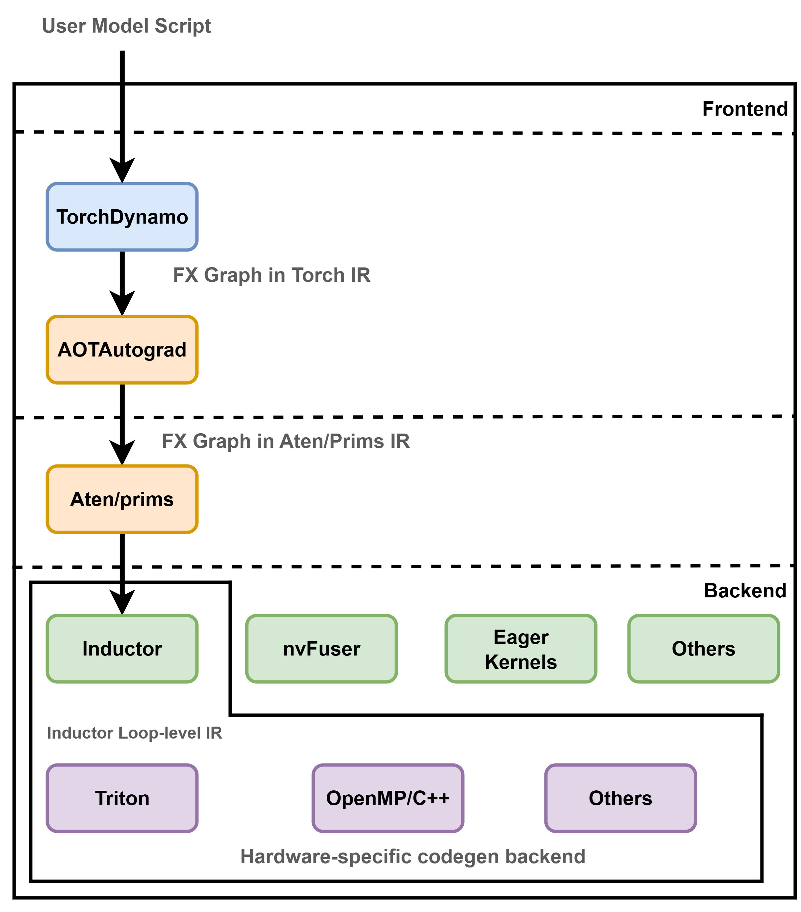

## Overview of PyTorch Runtime and Triton Runtime

### Overview of PyTorch 2.0 Compilation Mode

#### Introduction to `torch.compile`

`torch.compile(model, ...)` is a new API introduced in PyTorch 2.0 that converts dynamic PyTorch models into high-performance static graphs. It retains the dynamic eager-mode experience while delivering better performance for both training and inference.



### Key Components in the PyTorch Compilation Stack

#### 1. TorchDynamo

TorchDynamo is the front-end IR tracer in PyTorch’s compilation mode. It performs the following tasks:

* Intercepts eager execution to capture the FX graph
* Lowers high-level Python ops into a reduced set of \~250 PrimTorch operations
* Eliminates dead ops and redundant graph structures
* Feeds optimized graphs to downstream tools like AOTAutograd and TorchInductor

#### 2. PrimTorch

PrimTorch defines a minimal operator set for PyTorch internals:

* **Aten Ops**: Low-level operations matching ATen tensor operations
* **Prim Ops**: Core control-flow and metadata ops in PrimIR

By using PrimTorch, backends only need to support a small number of ops instead of thousands of high-level PyTorch operators.

#### 3. AOTAutograd

AOTAutograd (Ahead-of-Time Autograd) is a module for capturing backward graphs in advance:

* Separates forward and backward graphs for easier optimization
* Analyzes operator dependencies and schedules them efficiently
* Performs graph-level fusion and buffer reuse
* Enables cross-operator fusion to accelerate backpropagation


## TorchInductor Compiler Backend (Runtime)

TorchInductor is the default backend in PyTorch 2.0’s compiler stack. It compiles intermediate representation (IR) into high-performance code for both CPU and GPU.


### Compilation Pipeline Overview

```text
Input Code
    ↓
TorchDynamo captures FX Graph
    ↓
PrimTorch lowers ops
    ↓
AOTAutograd captures backward graph
    ↓
Inductor Graph Lowering
    ↓
Scheduling & Fusion
    ↓
Wrapper Codegen
    ↓
Backend Codegen (Triton or C++)
```

| Stage           | Description                                  |
| --------------- | -------------------------------------------- |
| TorchDynamo     | Captures Python execution and emits FX graph |
| PrimTorch       | Lowers to Prim/Aten core ops                 |
| AOTAutograd     | Pre-captures backward logic, applies fusion  |
| Graph Lowering  | Simplifies views, broadcasting, indexing     |
| Scheduling      | Performs tiling, fusion, memory reuse        |
| Wrapper Codegen | Emits code to call optimized kernels         |
| Backend Codegen | Generates C++ (CPU) or Triton (GPU) kernels  |


### Core Optimization Phases

* **Graph Lowering**: Eliminates view ops, simplifies broadcasting and layout
* **Scheduling**:

  * Horizontal and vertical fusion
  * Reduction optimizations (e.g., sum, max)
  * Tiling strategies
  * Memory buffer reuse
* **Wrapper Codegen**:

  * Replaces interpreter logic
  * Manages memory and in-place ops
  * Autotunes to find best-performing kernels


### Backend Codegen

* **CPU Backend**: Emits C++ / OpenMP
* **GPU Backend**: Emits Triton kernels for Tensor Core acceleration

Triton is a Python-based DSL for writing GPU kernels with block-level scheduling. PyTorch schedules and converts IR into Triton kernels automatically.


## Introduction to the Triton Runtime

### What is Triton

Triton is a GPU compiler framework built for ML workloads:

* Provides a Python DSL for writing GPU kernels
* Compiles to PTX/CUDA binaries
* Supports static memory scheduling, block/thread management, shared memory
* Deeply integrated with PyTorch's TorchInductor backend


### Triton’s Role in PyTorch

* TorchInductor generates Triton kernels automatically
* No manual Triton coding is needed
* Triton runtime handles kernel execution, scheduling, and tuning
* In `max-autotune` mode, kernel variants are benchmarked and the best configuration is selected


## Compilation Flow Example: From Input Code to Triton Kernel Generation

This section uses a minimal PyTorch example to demonstrate every stage in the PyTorch 2.0 compilation pipeline. Starting from a basic Python function, the compilation process proceeds through FX graph capture, Aten graph lowering, automatic differentiation, graph-level scheduling and fusion, and ultimately produces the corresponding Triton kernel and wrapper code for efficient execution on the GPU.


### 1. Input Code: User-defined Original PyTorch Program

This function is very simple and includes only two element-wise operations: it first applies `sin` to the input, then `cos` to the result.

```python
import torch

def toy_example(x):
    y = x.sin()
    z = y.cos()
    return z

x = torch.randn(1000, device="cuda", requires_grad=True)
compiled_f = torch.compile(toy_example, backend='inductor')
output = compiled_f(x)
```

Calling `torch.compile` triggers the full compilation pipeline and automatically lowers `toy_example` into low-level GPU execution code.


### 2. FX Graph IR: Intermediate Representation Captured by FX

In the first step, TorchDynamo intercepts the eager execution and transforms the Python function into an FX graph. The goal of this stage is to extract a static execution path and reduce it into a series of Python-style intermediate representations.

```python
def forward(self, l_x_: "f32[1000]"):
    y: "f32[1000]" = l_x_.sin();  l_x_ = None
    z: "f32[1000]" = y.cos();    y = None
    return (z,)
```

As shown above, variable lifetimes are clearly annotated in the graph (e.g., `l_x_ = None` indicates resource deallocation), and `sin()` and `cos()` are graph nodes.


### 3. ATen FX Graph IR: Mapping the FX Graph to ATen Ops

This stage occurs in AOTAutograd. The graph structure is reconstructed, and all FX operations are mapped to primitive ops in the `torch.ops.aten` namespace. The corresponding backward graph is also generated.

**Forward Graph:**

```python
def forward(self, primals_1: "f32[1000][1]cuda:0"):
    sin = torch.ops.aten.sin.default(primals_1)
    cos = torch.ops.aten.cos.default(sin);  sin = None
    return (cos, primals_1)
```

**Backward Graph:**

```python
def forward(self, primals_1: "f32[1000][1]cuda:0", tangents_1: "f32[1000][1]cuda:0"):
    sin = torch.ops.aten.sin.default(primals_1)
    sin_1 = torch.ops.aten.sin.default(sin);  sin = None
    neg = torch.ops.aten.neg.default(sin_1);  sin_1 = None
    mul = torch.ops.aten.mul.Tensor(tangents_1, neg);  tangents_1 = neg = None
    cos_1 = torch.ops.aten.cos.default(primals_1);  primals_1 = None
    mul_1 = torch.ops.aten.mul.Tensor(mul, cos_1);  mul = cos_1 = None
    return (mul_1,)
```

A key feature of this stage is that all operations are raw ATen ops, and the forward and backward paths are already separated, enabling later fusion and optimization.


### 4. Define-by-run IR & Scheduling/Fusion

The define-by-run IR is dynamically inferred at runtime based on input shapes and other information. Then, the Inductor applies a series of optimizations to the graph, including:

* **Scheduling Strategy Selection**: Determines the execution order and layout (loop nesting) of each op
* **Operator Fusion**: Attempts to fuse adjacent `sin` and `cos` into one kernel
* **Memory Layout Optimization**: Decides whether to rematerialize intermediate values or reuse buffers
* **Thread Block Mapping & Tiling**: Prepares the IR for the Triton backend to generate high-performance GPU code

This step determines how the kernel is ultimately structured.


### 5. Output Triton: Triton Kernel Code Generation

The Inductor compiles the scheduled graph into a Triton kernel. In this case, `sin` and `cos` are successfully fused into a single kernel:

```python
@triton.jit
def triton_(in_ptr0, out_ptr0, xnumel, XBLOCK: tl.constexpr):
    xnumel = 1000
    xoffset = tl.program_id(0) * XBLOCK
    xindex = xoffset + tl.arange(0, XBLOCK)[:]
    xmask = xindex < xnumel
    x0 = xindex
    tmp0 = tl.load(in_ptr0 + (x0), xmask)
    tmp1 = tl_math.sin(tmp0)
    tmp2 = tl_math.cos(tmp1)
    tl.store(out_ptr0 + (x0), tmp2, xmask)
```

As shown, this kernel code is fully statically generated and uses Triton's block-level parallelism. It is compiled into a PTX kernel for GPU execution.


### 6. Output Wrapper: Kernel Wrapper and Scheduling Code

The final compiled result is embedded in a Python function responsible for preparing inputs and invoking the kernel.

```python
def call(args):
    primals_1, = args
    args.clear()
    assert_size_stride(primals_1, (1000,), (1,))
    with torch.cuda._DeviceGuard(0):
        torch.cuda.set_device(0)
        buf0 = empty_strided_cuda((1000,), (1,), torch.float32)
        stream0 = get_raw_stream(0)
        triton_poi_fused_cos_sin_0.run(primals_1, buf0, 1000, grid=grid(1000), stream=stream0)
    return (buf0, primals_1)
```

This `call` function is the execution unit ultimately invoked by `compiled_f(x)`. It encapsulates memory allocation, CUDA stream setup, and the Triton kernel invocation, allowing the user to run the compiled model just like a normal PyTorch function.
