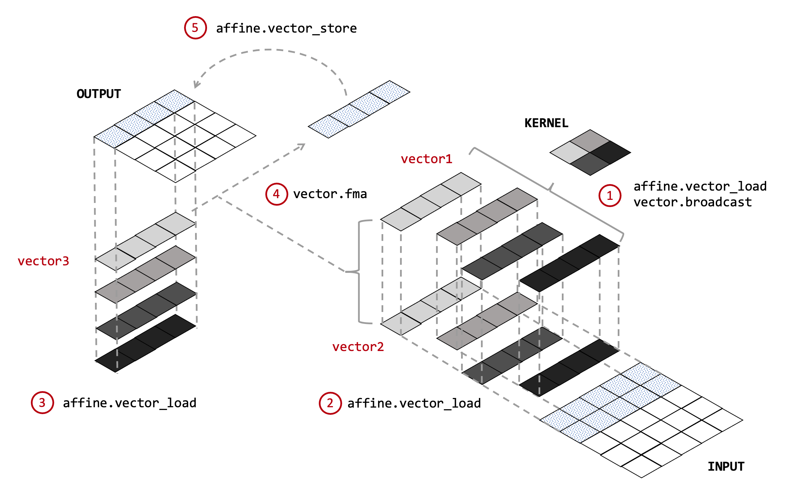

# Convolution Optimization Tool - conv-opt

## Covolution Optimization Algorithm

### Coefficient Broadcasting Algorithm

Coefficients broadcasting (CB) algorithm is a high-performance implementation of 2D convolution. 
The algorithm has been implemented with the intrinsic programming model and evaluated on Intel’s advanced vector extensions. [[Ref]](https://ieeexplore.ieee.org/abstract/document/8324097)
However, the intrinsic programming model is specific to ISA extensions, 
which means other targets cannot reuse the vectorization. 
Thus, we explored implementing the CB algorithm using MLIR. 
In this case, we can take advantage of the reusable and extensible features of MLIR and LLVM IR.

Let’s first introduce the MLIR dialects and operations that are needed by the algorithm.

- `affine.for`: executes loop body for specific times iterating from a lower bound to an upper bound by a stride. 
- `affine.vector_load`:returns a vector from a specific slice of buffer (MLIR MemRef).
- `affine.vector_store`: writes a vector into a specific slice of buffer (MLIR MemRef).
- `vector.broadcast`: broadcasts a scalar or vector value to an n-D result vector.
- `vector.fma`: performs fused multiply-add (FMA) on the vector type.

The figure shows the steps of the algorithm:
- Iterate over each kernel element and broadcast it to vector1.
- Load a slice of the input into the vector2 with the iteration index.
- Load a slice of the output into the vector3 with the outermost loop iteration index.
- Multiply and accumulate the vector1, vector2, and vector3.
- Store the result vector into the output buffer with the outermost loop iteration index.
