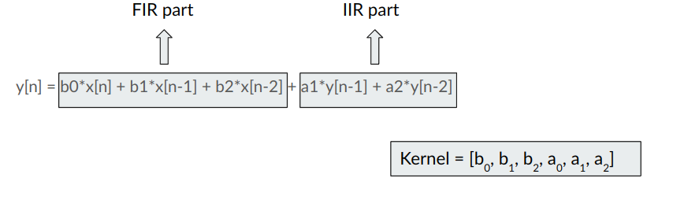

## DAP dialect

Audio Processing filters can be broadly classified as:
1. Finite Impluse Response (FIR) filter
2. Infinite Impluse Response (IIR) filter
    * Biquad filter
    * Cascading Biquad filter

Digital Audio Processing(DAP) Dialect is create for the purpose of developing a MLIR backend for performing operations like FIR, biquad, IIR(Cascading Biquad) etc.


It uses abstractions provided by the vector dialect for performing vector processing on different hardware configurations. Other dialects such as Memref dialect, affine dialect, etc. are also used for the purpose of storing and processing audio data. Following is a short description of operations currently present in DAP dialect :

### 1. Biquad (biquad) :
 This operation is used for performing the biquad filtering on the given audio data.

#### Algorithm: 
A biquad filter is the second order recursive linear filter. 

* Equation: 



Biquad Operation here is implemented in two parts ie FIR part and IIR part. The FIR part is enhanced by exploiting the vectorization and stored in the intermediate output. This intermediate state is then used to calculate the IIR part.


An example depicting the syntax of created API is :
 ```mlir
   dap.biquad %in, %filter, %out:
               memref<?xf32>, memref<?xf32>, memref<?xf32>
 ```
 where :
  - in : First argument, Input Audio data.
  - filter : Second argument, filter kernel.
  - out : Container for storing the result of biquad operation.

### 2. Cascading Biquad filter (iir) :
This operation is used to perform the IIR filtering on the audio data.   
High-order IIR filters can be highly sensitive to quantization of their coefficients, and can easily become unstable. This is much less of a problem with first and second-order filters; therefore, higher-order filters are typically implemented as serially-cascaded biquad sections.  

The implementation of Cascading Biquad filter as the name suggests cascades multiple biquad filters looping over each row in the Second Order Section Matrix.  

An example depicting the syntax of created API is :
 ```mlir
   dap.iir %in, %filter, %out:
               memref<?xf32>, memref<?x?xf32>, memref<?xf32>
 ```
 where :
  - in : First argument, Input Audio data.
  - filter : Second argument, Second Order Section Matrix.
  - out : Container for storing the result of biquad operation.
