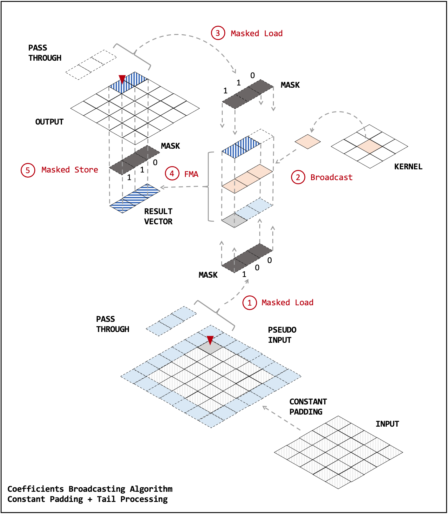
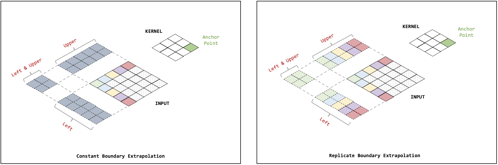
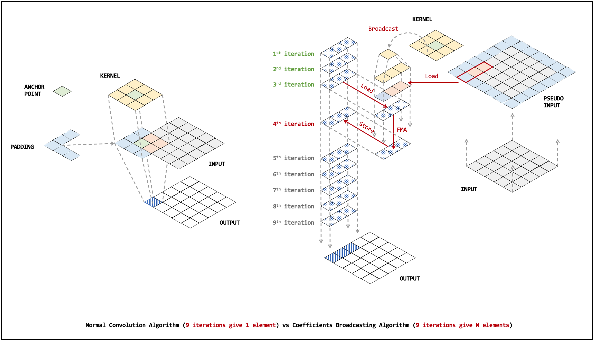
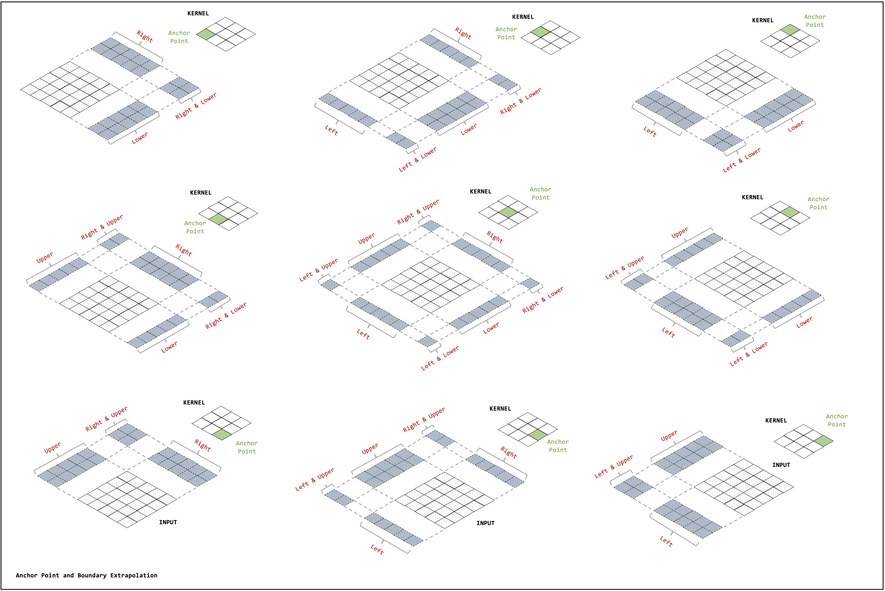

## DIP dialect
Digital image processing(DIP) dialect is created for the purpose of developing a
MLIR backend for performing operations such as correlation, convolution,
morphological processing, etc on images.

It uses abstractions provided by the vector dialect for performing vector
processing on different hardware configurations. Other dialects such as Memref
dialect, scf dialect, etc. are also used for the purpose of storing and
processing image data. Following is a short description of operations currently
present in DIP dialect :

### 1. 2D Correlation(corr_2d) :
This operation is used for performing 2D correlation on an image. The 2D
correlation API provided by the linalg dialect is more suited for applications
in which boundary extrapolation is not explicitly required. Due to this,
dimensions of output are always less than the input dimensions after using
linalg dialect's 2D correlation API.

dip.corr_2d performs boundary extrapolation for making the size of output image
equal to the size of input image and then uses coefficient broadcasting and
strip mining(CBSM) approach for performing correlation as shown in following
schematic :


Boundary extrapolation can be done using
different methods, supported options are :
 - Constant Padding : Uses a constant for padding whole extra region in input
image for obtaining the boundary extrapolated output image. (kkk|abcdefg|kkk)
 - Replicate Padding : Uses last/first element of respective column/row for
padding the extra region used for creating the boundary extrapolated output
image. (aaa|abcdefg|ggg)

Effects of above mentioned boundary extrapolation methods are as follows :


An example depicting the syntax of created API is :
 ```mlir
   dip.corr_2d boundaryOption %input, %kernel, %output, %centerX, %centerY, %constantValue :
               memref<?x?xf32>, memref<?x?xf32>, memref<?x?xf32>, index, index, index
 ```
 where :
  - input : First argument for 2D correlation.
  - kernel : Second argument for 2D correlation.
  - output : Container for storing the result of 2D correlation.
  - centerX : x co-ordinate of anchor point
  - centerY : y co-ordinate of anchor point
  - constantValue : Value of constant which is to be used in padding during `CONSTANT_PADDING` boundary extrapolation.
  - boundaryOption : Specifies desired type of boundary extrapolation. Permissible values are `CONSTANT_PADDING` and `REPLICATE_PADDING`.

#### Algorithm :
We use a modified version of coefficient broadcasting and strip mining(CBSM)
approach for correlating a 2D image with a 2D kernel. CBSM involves processing
several pixel elements together in a vectorized fashion. As a result, we can
process multiple pixels in the same number of steps which would otherwise be
required during typical single pixel processing. Variable length vector
registers of RISC-V architecture help in further improving the performance as we
can choose the suitable size of register to be used in required calculations.

This is depicted by the following schematic :


The process of 2D correlation results in smaller dimensions of output as
compared to input. In order to equate the dimensions of input image and output
image, we assume a pseudo input Image which is created after applying boundary
extrapolation techniques on the original input image for dip.corr_2d. This
pseudo image when correlated with the given kernel produces an output image
having its dimensions equal to the original input image. Please note that the
pseudo input image is never created/stored in memory, instead we will use some
techniques to mimic the processing for producing expected results.

The differences in working of plain CBSM approach and our implementation are
further demonstrated by following schematics :

#### CBSM approach


#### Our implementation


We divide the pseudo input image into 9 different regions. Each of these regions
can then be processed separately and used for producing the output image without
actually creating a pseudo input image of larger dimensions in memory.

The pseudo input image is divided on the basis of the type of extrapolation
required for processing each region. Following are the considered types of
extrapolation :
1. Left extrapolation : Perform boundary extrapolation exclusively in Left
direction.
2. Right extrapolation : Perform boundary extrapolation exclusively in the right
direction.
3. Upper extrapolation : Perform boundary extrapolation exclusively in upper
direction.
4. Lower extrapolation : Perform boundary extrapolation exclusively in the lower
direction.

On the basis of above mentioned 4 types, we can divide the pseudo input image
into 9 different regions as follows :
1. Upper row left col : Apply left and upper extrapolation.
2. Upper row mid col : Apply upper extrapolation.
3. Upper row right col : Apply right and upper extrapolation.
4. Mid row left col : Apply left extrapolation.
5. Mid row mid col : Process original input image without any extrapolation.
6. Mid row right col : Apply right extrapolation.
7. Lower row left col : Apply left and lower extrapolation.
8. Lower row mid col : Apply lower extrapolation.
9. Lower row right col : Apply right and lower extrapolation.

Following schematic depicts the process(with boundary extrapolation and variable
anchor point positioning) for two dimensional correlation between a 5x5 image
and a 3x3 kernel


### 2 Morphological Operations 

All the Morphological Tranformations perform boundary extrapolation for making the size of output image
equal to the size of input image and then uses coefficient broadcasting and
strip mining(CBSM) approach for performing erosion.

Boundary extrapolation can be done using
different methods, supported options are :
 - Constant Padding : Uses a constant for padding whole extra region in input
image for obtaining the boundary extrapolated output image. (kkk|abcdefg|kkk)
 - Replicate Padding : Uses last/first element of respective column/row for
padding the extra region used for creating the boundary extrapolated output
image. (aaa|abcdefg|ggg)

The Algorithm used is similar to that of correlation_2d.

The approach is similar to 2d correlation except the minimum or maximum element(for erosion and dilation respectively) in the input image in the rectangular region of the kernel is filled.

#### 1 . 2D Erosion(erosion_2d) 

erosion_2d follows an approach similar to correlation_2d except the minimum element in the input image present in the rectangular region of the kernel is filled in the output image.

An example depicting the syntax of created API is :
 ```mlir
   dip.erosion_2d boundaryOption %input, %kernel, %output, %centerX, %centerY, %constantValue, %copymemref :
               memref<?x?xf32>, memref<?x?xf32>, memref<?x?xf32>, index, index, index, memref<3x3xf32>
 ```
 where :
  - input : First argument for 2D erosion.
  - kernel : Second argument for 2D erosion.
  - output : Container for storing the result of 2D erosion.
  - centerX : x co-ordinate of anchor point
  - centerY : y co-ordinate of anchor point
  - constantValue : Value of constant which is to be used in padding during `CONSTANT_PADDING` boundary extrapolation.
  - copymemref : Intermidiate memref to reinitialize the output container after every iteration.
  - boundaryOption : Specifies desired type of boundary extrapolation. Permissible values are `CONSTANT_PADDING` and `REPLICATE_PADDING`.

#### 2 . 2D Dilation(dilation_2d) 

dilation_2d follows an approach similar to correlation_2d except the maximum element in the input image present in the rectangular region of the kernel is filled in the output image.

An example depicting the syntax of created API is :
 ```mlir
   dip.dilation_2d boundaryOption %input, %kernel, %output, %centerX, %centerY, %constantValue, %copymemref :
               memref<?x?xf32>, memref<?x?xf32>, memref<?x?xf32>, index, index, index, memref<3x3xf32>
 ```
 where :
  - input : First argument for 2D dilation.
  - kernel : Second argument for 2D dilation.
  - output : Container for storing the result of 2D dilation.
  - centerX : x co-ordinate of anchor point
  - centerY : y co-ordinate of anchor point
  - constantValue : Value of constant which is to be used in padding during `CONSTANT_PADDING` boundary extrapolation.
  - copymemref : Intermidiate memref to reinitialize the output container after every iteration.
  - boundaryOption : Specifies desired type of boundary extrapolation. Permissible values are `CONSTANT_PADDING` and `REPLICATE_PADDING`.

  #### 3 . 2D Opening(opening_2d)

  Opening transformation is defined as performing erosion followed by dilation on an input image.
  opening(input) = dilation(erosion(image))

  An example depicting the syntax of created API is :
 ```mlir
   dip.opening_2d boundaryOption %input, %kernel, %output, %output1, %centerX, %centerY, %constantValue, %copymemref, %copymemref1 :
               memref<?x?xf32>, memref<?x?xf32>, memref<?x?xf32>, memref<3x3xf32>, index, index, index, memref<3x3xf32>, memref<3x3xf32>
 ```
 where :
  - input : First argument for 2D opening.
  - kernel : Second argument for 2D opening.
  - output : Container for storing the final result of 2D opening.
  - output1 : Intermidiate container to store the output of erosion sub-part in opening operation
  - centerX : x co-ordinate of anchor point
  - centerY : y co-ordinate of anchor point
  - constantValue : Value of constant which is to be used in padding during `CONSTANT_PADDING` boundary extrapolation.
  - copymemref : Intermidiate memref to reinitialize the output container after every iteration.(used in erosion sub-part)
  - copymemref1 : INtermidiate memref to reinitialize the output container after every iteration.(used in dilation sub-part)
  - boundaryOption : Specifies desired type of boundary extrapolation. Permissible values are `CONSTANT_PADDING` and `REPLICATE_PADDING`.

  #### 4 . 2D Closing(closing_2d)

  Closing transformation is defined as performing dilation followed by erosion on an input image.
  closing(image) = erosion(dilation(image))

  
An example depicting the syntax of created API is :
 ```mlir
   dip.closing_2d boundaryOption %input, %kernel, %output, %output1, %centerX, %centerY, %constantValue, %copymemref, %copymemref1 :
               memref<?x?xf32>, memref<?x?xf32>, memref<?x?xf32>, memref<3x3xf32>, index, index, index, memref<3x3xf32>, memref<3x3xf32>
 ```
 where :
  - input : First argument for 2D closing.
  - kernel : Second argument for 2D closing.
  - output : Container for storing the final result of 2D closing.
  - output1 : Intermidiate container to store the output of dilation sub-part in closing operation
  - centerX : x co-ordinate of anchor point
  - centerY : y co-ordinate of anchor point
  - constantValue : Value of constant which is to be used in padding during `CONSTANT_PADDING` boundary extrapolation.
  - copymemref : Intermidiate memref to reinitialize the output container after every iteration.(used in dilation sub-part)
  - copymemref1 : INtermidiate memref to reinitialize the output container after every iteration.(used in erosion sub-part)
  - boundaryOption : Specifies desired type of boundary extrapolation. Permissible values are `CONSTANT_PADDING` and `REPLICATE_PADDING`.

  #### 5 . 2D TopHat(tophat_2d)

  TopHat transformation is defined as subtracting the opening of an image from the image itself.

  tophat(image) = image - opening(image)

  An example depicting the syntax of created API is :
 ```mlir
   dip.tophat_2d boundaryOption %input, %kernel, %output, %output1, %output2, %centerX, %centerY, %constantValue, %copymemref, %copymemref1 :
               memref<?x?xf32>, memref<?x?xf32>, memref<?x?xf32>, memref<3x3xf32>, memref<3x3xf32>, index, index, index, memref<3x3xf32>, memref<3x3xf32>
 ```
 where :
  - input : First argument for 2D tophat.
  - kernel : Second argument for 2D tophat.
  - output : Container for storing the final result of 2D tophat.
  - output1 : Intermidiate container to store the output of erosion sub-part in tophat operation.
  - output2 : Intermidiate container to store the output of the dilation sub-part in tophat operation.
  - centerX : x co-ordinate of anchor point
  - centerY : y co-ordinate of anchor point
  - constantValue : Value of constant which is to be used in padding during `CONSTANT_PADDING` boundary extrapolation.
  - copymemref : Intermidiate memref to reinitialize the output container after every iteration.(used in erosion sub-part)
  - copymemref1 : INtermidiate memref to reinitialize the output container after every iteration.(used in dilation sub-part)
  - boundaryOption : Specifies desired type of boundary extrapolation. Permissible values are `CONSTANT_PADDING` and `REPLICATE_PADDING`.

  #### 6 . 2D BottomHat(bottomhat_2d) 

  BottomHat transformation is defined as subtracting the input image from the closing of the image.
  bottomhat(image) = closing(image) - image

  An example depicting the syntax of created API is :
 ```mlir
   dip.bottomhat_2d boundaryOption %input, %kernel, %output, %output1, %output2, %centerX, %centerY, %constantValue, %copymemref, %copymemref1 :
               memref<?x?xf32>, memref<?x?xf32>, memref<?x?xf32>, memref<3x3xf32>, memref<3x3xf32>, index, index, index, memref<3x3xf32>, memref<3x3xf32>
 ```
 where :
  - input : First argument for 2D bottomhat.
  - kernel : Second argument for 2D bottomhat.
  - output : Container for storing the final result of 2D bottomhat.
  - output1 : Intermidiate container to store the output of dilation sub-part in bottomhat operation.
  - output2 : Intermidiate container to store the output of the erosion sub-part in bottomhat operation.
  - centerX : x co-ordinate of anchor point
  - centerY : y co-ordinate of anchor point
  - constantValue : Value of constant which is to be used in padding during `CONSTANT_PADDING` boundary extrapolation.
  - copymemref : Intermidiate memref to reinitialize the output container after every iteration.(used in dilation sub-part)
  - copymemref1 : INtermidiate memref to reinitialize the output container after every iteration.(used in erosion sub-part)
  - boundaryOption : Specifies desired type of boundary extrapolation. Permissible values are `CONSTANT_PADDING` and `REPLICATE_PADDING`.

  #### 7. 2D MorphGrad(morphgrad_2d)

  MorphGrad Trabsformation is defined as subtracting erosion of an image from the dilation of an image.

  morphgrad(image) = dilation(image) - erosion(image)

  An example depicting the syntax of created API is :
 ```mlir
   dip.morphgrad_2d boundaryOption %input, %kernel, %output, %output1, %output2, %centerX, %centerY, %constantValue, %copymemref, %copymemref1 :
               memref<?x?xf32>, memref<?x?xf32>, memref<?x?xf32>, memref<3x3xf32>, memref<3x3xf32>, index, index, index, memref<3x3xf32>, memref<3x3xf32>
 ```
 where :
  - input : First argument for 2D morphgrad.
  - kernel : Second argument for 2D morphgrad.
  - output : Container for storing the final result of 2D morphgrad.
  - output1 : Intermidiate container to store the output of dilation sub-part in morphgrad operation.
  - output2 : Intermidiate container to store the output of the erosion sub-part in morphgrad operation.
  - centerX : x co-ordinate of anchor point
  - centerY : y co-ordinate of anchor point
  - constantValue : Value of constant which is to be used in padding during `CONSTANT_PADDING` boundary extrapolation.
  - copymemref : Intermidiate memref to reinitialize the output container after every iteration.(used in dilation sub-part)
  - copymemref1 : INtermidiate memref to reinitialize the output container after every iteration.(used in erosion sub-part)
  - boundaryOption : Specifies desired type of boundary extrapolation. Permissible values are `CONSTANT_PADDING` and `REPLICATE_PADDING`.
