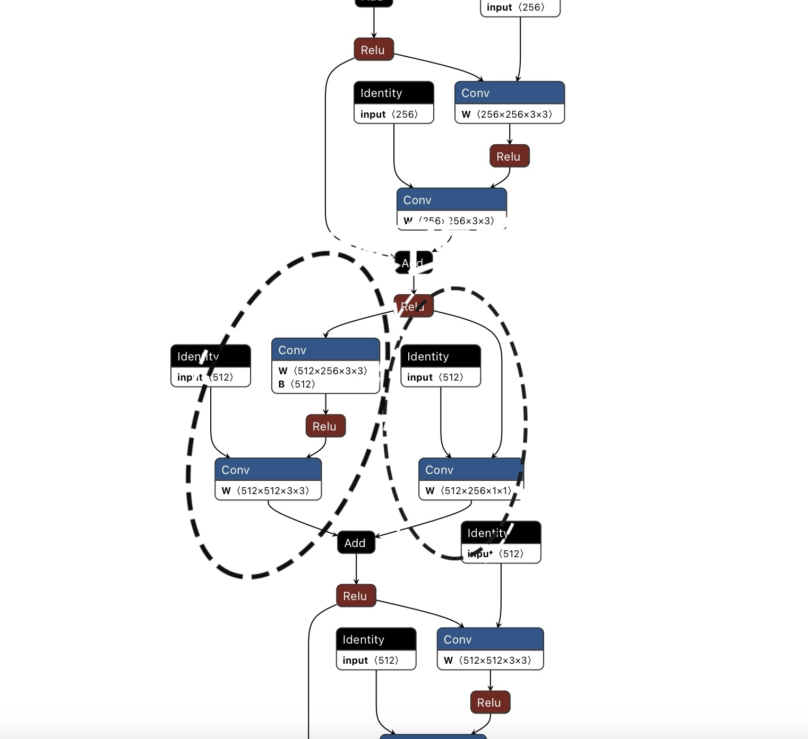

# 图级别优化策略

——张煦正

本技术文档为初步版本，可能会有考虑不充分的地方待日后完善。策略为了综合考虑op fusion、kernel fusion、数据的parallel、子图的parallel，借鉴了XLA、TVM、Astitch、Rammer、Apollo

# 图优化流程

1） 针对DAG切分出子图

2） 子图优化、codegen

3） 全局子图schedule

# 切分子图

             ⬇️

子图subgraph会成为后面进行算子融合的基本单元

切分策略：

DFS/BFS的方式遍历DAG

切分策略取绝于划分图的标准是什么？ ToDO

（Astitch：寻找经验上最重要的op节点（经验上寻找reduce节点性能最优），向外扩散切分

（TVM： 依据支配关系划分

（pytorch、XLA:  定义pattern样式进行匹配

目前倾向于划分形如⬇️这样的结构（TVM支配树算法，区别在于后文的融合策略有不同；这样的结构之间也可以借鉴stitch策略

conv2d
/  |  \
/   |   \
op    op   op
\    |    /
\   |   /
elem-wise

这样的切分可以很容易的划分出可以融合的算子分支（尤其是在综合了Astitch和rammer并行提供的思路后，这样切分也许是并行和融合的一个平衡

# 子图内fusion

## op fusion:

### op分类：

根据运算的数据依赖分类，分为independent、one-to-one、one-to-many、complicated

independent：算子元素间不存在依赖关系

one-to-one：算子元素间存在一对一的依赖；例：所有element-wise操作

one-to-many：算子元素间存在一对多的依赖关系；例：reduce操作为主

complicated：算子元素间的依赖关系复杂

### one-to-one：

对于one-to-one算子可以进行直接fusion，可以沿用一般策略

例如：conv+Batchnorm

每个元素将多步计算合并为一个。

🌟两种方案：

方案一：

在mlir dialect方言的基础上实现相应的fused算子；当在子图中做fusion时匹配，匹配后调用新加入的算子

方案二：

沿用已经存在的算子，对计算过程进行调整。如上例，修改w和b即可。

### one-to-many/stitch:

🌟对于one-to-many算子，传统的fusion方式会产生很多冗余计算。如下图

这是一个power<2>+broadcast+add操作

power<2>被重复计算了128次。

🌟又或是以下的图级别的one-to-many依赖：

当算子节点间存在多分支时也属于图级别的one-to-many。此时add可以和relu融合，但会产生多余的一次计算。

🌟方案一：stitch策略

stitch策略本质是：不融合策略的访问片外存储的过程 ➡️ 一级缓存

xing方案二：人为处理

在识别算子fusion中加入规则。当遇到如上图例子的one-to-many时只重复一次one-to-many前算子的计算  （此方案不确定是否可以很好的泛化

### complicated：

stitch策略可以推广到任意多级数据复用； stitch是本质上是在producer和consumer间增加数据复用的缓存

one-to-one 融合（最传统的直接fusion）：寄存器作为缓存

one-to-many融合 ： shared memory/cache作为缓存

complicated算子的融合 ： 

相邻的fused算子和不能fusion的算子间做stitch——kernel融合：

通过推广复用的做法可以将很多的算子融合在一起，但有些避免不了还是需要写会到内存当中。这种情况下收益只存在于将很多的算子kernel融合到了一个kernel

（Astitch采用了这种很激进的融合策略。查阅一些评论和论坛发现，有时Astitch可能会吧整个计算图融合成一个超大的算子，总共一个kernel。可能存在一些弊端

（并且在很多复杂的数据依赖算子中，写会内存就是缓冲手段，我认为这样本质上并没有节省仿存开销，只是融合了kernel

## 算子层面的shape优化：

### 不规则shape造成的浪费：

a)这是DIEN模型中的一个实际案例。将形状从 <750000,32> 降维为 <750000> 时进行的行降维操作，在XLA上出现了小块大小的问题。在这种情况下，XLA 自动生成了 750,000 个 GPU 线程块，每个块的大小为32。当线程块大小太小时，EU上会产生大片的空闲，任何给定时间的并发性也很低。

b)这是 Transformer 模型中的一个实际案例。对形状从 <64,30000> 降维为 <64> 的行降维操作，导致 XLA 上出现小块计数问题。XLA 自动生成了 64 个大小为 1024 的线程块，而 V100 GPU 可以同时调度 160个 相同大小的线程块，导致严重的硬件利用不足。

### 解决方案——adaptive mapping：

这样的问题也主要出现在reduce等维度会产生变化的算子当中去

往往需要根据不同的后端体系结构设计不同的划分策略。当遇到线程块少的情况时需要适当将下一维度的内容拼接到上一维度。

如：<750000,32>  ➡️ <187500，128>  ➡️ <187500，4> ➡️ <750000> （假设后端设备的EU空间支持一次处理128个线程的内容

## subgraph的schedule：

假设上图圈出的部分是划分出来的两个子图。

可以通过在创建subgraph的过程中维护subgraph的生产者节点和subgraph在图中的深度。相同的生产者节点或者相同的深度意味着两个子图可以存在并行的执行调度。

subgraph内的schedule也可以这样编排，尽可能的寻找并行的可能性。