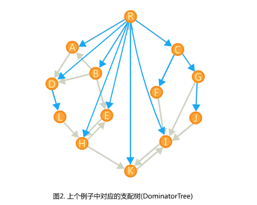

# 图优化技术方案
通过设计若干个mlir-pass来对神经网络前端进行图层优化。在前端获取到神经网络结构后，依次通过下面的几个pass来完成对图层的优化。
##死代码消除
首先进行死代码消除。在编译器前端获取到相应的网络结构后，首先获取各个结点之间的数据依赖关系，丢弃对最终输出阶段没有依赖的结点。

## 子图替换和数据布局转换
子图替换和数据布局转换pass，在激活函数处对输入的计算图进行分割，对每个分割后得到计算图进行子图替换操作。
可以通过设计相应的替换规则函数，覆盖常见的替换规则，然后对这些规则函数进行遍历，执行满足转换条件的规则作为候选，在经过若干个循环搜索后选取候选中的最优结果。在此步中也可以加入针对硬件设计的数据布局转换规则，与子图替换一同执行，以便于选取出更优结果。由于项目时间关系，大约替换规则只会考虑几种主要的替换，比如矩阵乘法次序转换，矩阵乘法分配率，矩阵切分和矩阵融合等。
对于数据布局转换，考虑通用cpu和gpu的数据布局和算子特性来对数据布局进行修改。

## 算子融合
可以考虑TVM采用的支配树的方式来完成算子融合。支配树由图中各个点的最近支配点组成，支配点即图中由根结点到一个结点的路径必须经过的结点，将除root外所有结点与其最近支配结点相连，所构成的树称为支配树。

在TVM中，通过判断一个结点到其支配树上所有路径的结点是否可以进行算子融合，来决定是否进行算子融合操作。
所以可以在BUDDY前端加入算子融合pass，在pass中先构造支配树，然后检查支配树的各个边能否进行算子融合，符合则将其融合到一个图组内，不能融合的算子的自己放入到一个图组中。其中检查操作通过算子的类型进行判断，需要提前定义函数来加入可融合的算子类型和融合规则。这些可以在BUDDY的graph中实现。
