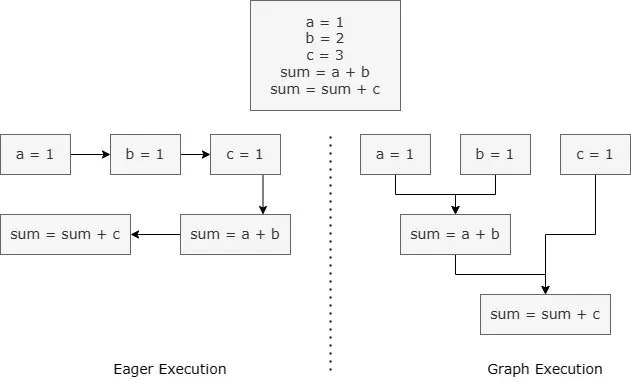
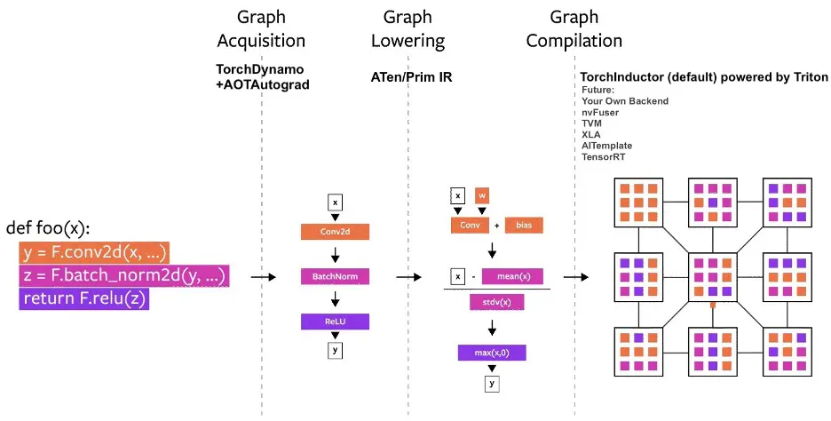
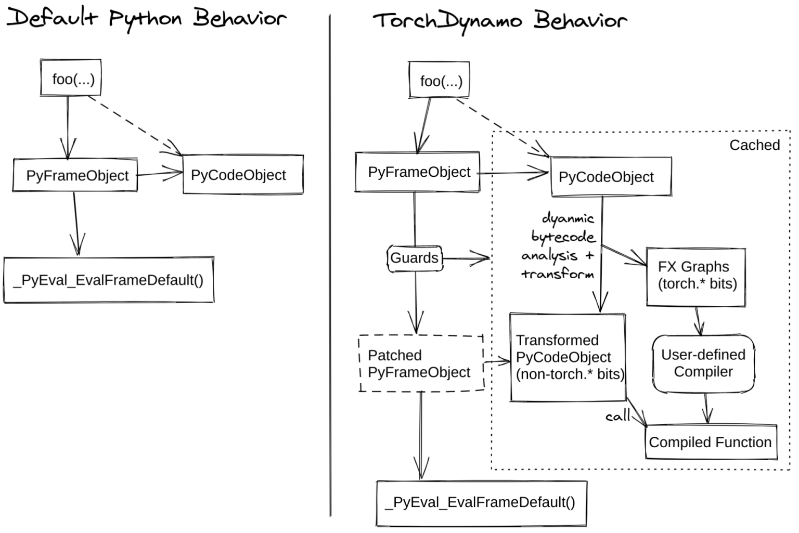
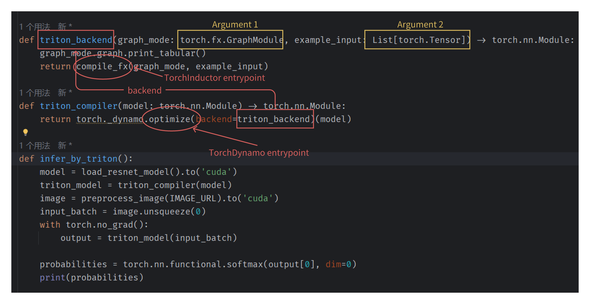

# PyTorch 2.0: Triron Acceleration GPU Kernel Execution

[PyTorch](https://pytorch.org/) is a widely adopted open-source deep learning framework that has gained significant
traction in both academic
and industrial research due to its flexibility, dynamic computational graph paradigm, and seamless integration with
Python.

To leverage these resources and deliver high-performance eager execution, the PyTorch developers announce the PyTorch
2.0 shipped with `TorchDynamo` and `TorchInductor`, which improves the performance of the same
model [about 60%](https://github.com/pytorch/pytorch/issues/93794#issuecomment-1233828468) with just
one line code change.

### Eager Execution vs. Graph Execution

Before introducing the PyTorch 2.0 design and implementation, the *eager* execution and *graph*
execution should be introduced firstly.



As the figure shows:

- An eager execution evaluates the operations immediately and at run time. The programs are generally easy to write,
  test, and debug with a natural Python-like syntax design. However, because of its nature, it fails to fully leverage
  the capabilities of hardware accelerators like GPUs. PyTorch is a common example that follows eager execution.
- Graph execution, on the other hand, builds a graph of all operations and operands before running. Such an execution is
  much faster than an eager one, as the graph formed can be optimized to leverage the capabilities of hardware
  accelerators. However, such programs take more work to write and debug. TensorFlow is a typical example that follows
  graph execution.

## `torch.compiler` Function

The core of PyTorch 2.0 is `torch.compile` function, which wraps the standard(original) PyTorch model, optimizes it
under the hood and returns the compiled version. When warping the mode using the `torch.compile`, the model goes through
the following steps showed in the figure.



The steps are also shows as follows:

1. **Graph Acquisition**:  The model is broken down and re-write into subgraphs. Subgraphs that can be compiled or
   optimized are flattened, whereas the other subgraphs which can't be compiled will fall back to the eager model.
2. **Graph Lowering**: All PyTorch operations are decomposed into their chosen backend-specific kernels.
3. **Graph Compilation**: All the backend kernels call their corresponding low-level device operations.

As the figure shows, the core components of `torch.compiler` is the `TorhcDynamo`
and `TorchInductor`.

### TorchDynamo

TorchDynamo (shown in below figure) is PyTorch’s latest compiler solution that leverages JIT (Just In
Time) compilation to transform a general Python program into an FX Graph. The FX Graph is an intermediate representation
of your code that can be further compiled and optimized. TorchDynamo extracts FX Graphs by inspecting Python byte code
at runtime and detecting calls to PyTorch operations.

\begin{figure}[htb]
\centering
\includegraphics[width=0.9\linewidth]{assets/torch-dynamo.png}
\caption{The default python vs. TorchDynamo behavior.}
\label{fig:torch-dynamo}
\end{figure}



Additionally, TorchDynamo is designed to mix Python execution with compiled backends to get the best of both worlds:
usability and performance. Finally, it can support the arbitrary program by breaking the FX Graph whenever it encounters
any unsupported feature (e.g., data-dependent flows or non-PyTorch libraries).

### TorchInductor

TorchDynamo should be paired with a backend that can efficiently convert captured FX Graphs into fast machine code to
make PyTorch 2.0 programs faster. Some have fundamentally different execution models than PyTorch, and others are only
optimized for inference and not training. Table \ref{tab:torch-backends} shows parts of the supported PyTorch backends.

| **Backend** | **Description**                                                  |
|-------------|------------------------------------------------------------------|
| inductor    | Use the Triton for GPU and C++/OpenMP for CPU.                   |
| cudagraphs  | CUDA graphs with AOT Autograd                                    |
| ipex        | Uses IPEX on CPU                                                 |
| onnxrt      | Uses the ONNX runtime for training and inferring on CPU and GPUs |
| tensorrt    | Uses Torch-TensorRT for inference optimization                   |
| tvm         | Uses Apache TVM for inference optimization                       |
| openvino    | Uses OpenVINO for inference optimization                         |

TorchInductor is the new compiler backend that compiles the FX Graphs generated by TorchDynamo into optimized C++/Triton
kernels. TorchInductor uses a python-styled define-by-run loop level intermediate representation to automatically map
PyTorch models into generated Triton code on GPUs and C++/OpenMP on CPUs. TorchInductor’s core loop level intermediate
representation contains only ~50 operators, and it is implemented in Python, making it easily hackable and extensible.

### Triton

The Triton language or programming model is not a part of PyTorch, but it is the fundamental of the high-performance
kernel execution on the GPUs. Triton is a domain-specific language (DSL) and compiler framework designed for
high-performance GPU programming, particularly tailored for deep learning workloads. Developed by OpenAI, Triton enables
developers to write low-level GPU kernels with Python-like syntax while abstracting away the complexities of CUDA
programming. Its primary goal is to bridge the gap between high-level deep learni ng frameworks (e.g., PyTorch) and
low-level hardware optimizations, offering a flexible and efficient alternative to traditional CUDA development. 

## Code Flow Graph

The following figure demonstrates the `torch.compile` function calling graph when using the `TorchInductor` backend. In
this graph, we implement a custom `torch.compile` function called `triton_compiler` function which receive an argument
with type `torch.nn.Module` and return a `torch.nn.Module`.

> The argument and returning value may also be a Python Callable object.



This `triton_compiler` function will call the `TorchDynamo` entrypoint `torch._dynamo.optimize` function, which function 
receives multiple keyword arguments and the most important argument is `backend`. The `backend` argument is also a Python
Callable object. The signature of a `backend` function is

```python
def backend(gm: torch.fx.GraphModule, example_input: List[torch.Tensor]) -> torch.nn.Module:
```

This function contains two parameters:
1. `torch.fx.GraphModule`: this is a structured graph of the input code, the backend implementation can use this to gain information from source code.
2. `List[torch.Tensor`: a fake tensor list of the model input to assistant the code generation.

Below figure shows an example of `torch.fs.GraphModule` structured output:

```
opcode         name    target               args          kwargs
-------------  ------  -------------------  ------------  --------
placeholder    a       a                    ()            {}
placeholder    b       b                    ()            {}
call_function  matmul  aten.matmul.default  (a, b)        {}
output         output  output               ((matmul,),)  {}
```

As the example shows, the `GraphModule` uses a function called `aten.matmul.default`. To interactive with multiple backends,
the Python provides two set of IRs called Core Aten IR and Prims IR.

- Prims IR stands for primary IR with about 250~ operators, which is fairly low-level and suitable for compilers.
- ATen IR with about 750~ canonical operators and suited for exporting as-is.

After compiling, the backend compiler function will return a `torch.nn.Module` like object or Python Callable object for
uses to invoke.
