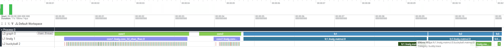

# Trace framework design

This is a unified trace framework for workload profiling and debugging.

**Execution flow Overview**
In the frontend, a transform pass traverses the Buddy graph and inserts trace start/end operations from a manually written `trace.toml`. In the backend, adding `-convert-trace-to-llvm="tensor-trace,cycle-trace"` to the pipeline lowers all trace nodes into corresponding runtime function calls. `tensor-trace` exports the associated tensor to a log file for debugging, while `cycle-trace` reads the hardware cycle counter twice to measure performance, with the concrete implementation provided by the runtime (e.g., `rdtime` or `rdcycle` on RISC-V).

**Extensibility**
The aim of this framework is to be designed to be sufficiently extensible, so that different traces can be added in the future.
- At the frontend, the transform design allows developers to modify `lowering.py` to support additional attributes passed through `trace.toml`.
- At the middleend, custom trace passes can be added for any dialect.
- At the backend, the runtime interface is device-agnostic and can in principle target any backend.

# How to use trace to profile/debug your workload?

### 1. Run in no-trace mode and read generated buddy graph

For [example](https://github.com/buddy-compiler/buddy-examples/blob/main/models/models/LeNet/buddy-lenet-import.py), disable trace and enable verbose lowering:

```python
dynamo_compiler = DynamoCompiler(
  primary_registry=tosa.ops_registry,
  aot_autograd_decomposition=inductor_decomp,
  verbose=True,
  verbose_path=model_dir / "output" / "buddy-graph.txt",
  trace=None,
)
```
You can see generated buddy graph under the `verbose_path`.

### 2. Write `trace.toml` based on this file

Each trace entry contains:

- `node`: Buddy graph node name from `buddy-graph.txt`.
- `id`: Unique integer trace id, or a trace id path such as `[0]`.
- `tag`: Human readable name used by the profiling/debugging script.

Example:

```toml
[[trace.node]]
node = "convolution"
id = 0
tag = "conv1_out"
```

### 3. Implement backend runtime hooks

Implement the runtime functions selected by `-convert-trace-to-llvm="tensor-trace,cycle-trace"`:

```
# Tensor trace runtime hook.
extern "C" void _mlir_ciface_buddyTraceTensorF32(int64_t id, StridedMemRefType<float, 1> *tensor)
extern "C" void _mlir_ciface_buddyTraceTensorBF16(int64_t id, StridedMemRefType<uint16_t, 1> *tensor)

# Cycle trace runtime hooks.
extern "C" void _mlir_ciface_buddyTraceCycleStart(int64_t id)
extern "C" void _mlir_ciface_buddyTraceCycleEnd(int64_t id)
```

An example runtime is implemented [here](https://github.com/buddy-compiler/buddy-examples/blob/main/models/lib/CRunnerUtils.cpp)


The output directories are created by the workload build rule before running the binary.

### 4. Compile and Run

Compile and run the workload as usual. You can see trace log files under `trace` directory (In the same directory as your executable file).

```text
cycle/trace-<id>.txt
tensor/trace-<id>.txt
```

Notes: Tensor-trace affects the cycle-trace statistics (due to the addition of extra data movement)

### 5. (Optional) Visualize trace results

An example visualization script is [perfetto.py](https://github.com/buddy-compiler/buddy-examples/blob/main/models/scripts/perfetto.py)

Convert the trace output into Perfetto JSON:

```bash
python3 perfetto.py /path/to/trace_output_dir /path/to/trace.toml
```

The default output is `perfetto.json`. You can view it on this [website](https://www.ui.perfetto.dev).



> Multi-level trace is an extended feature; for details on how to use it, please refer to [this](https://github.com/buddy-compiler/buddy-examples/blob/buckyball/models/models/LeNet/trace/trace-linalg-buckyball.toml)
